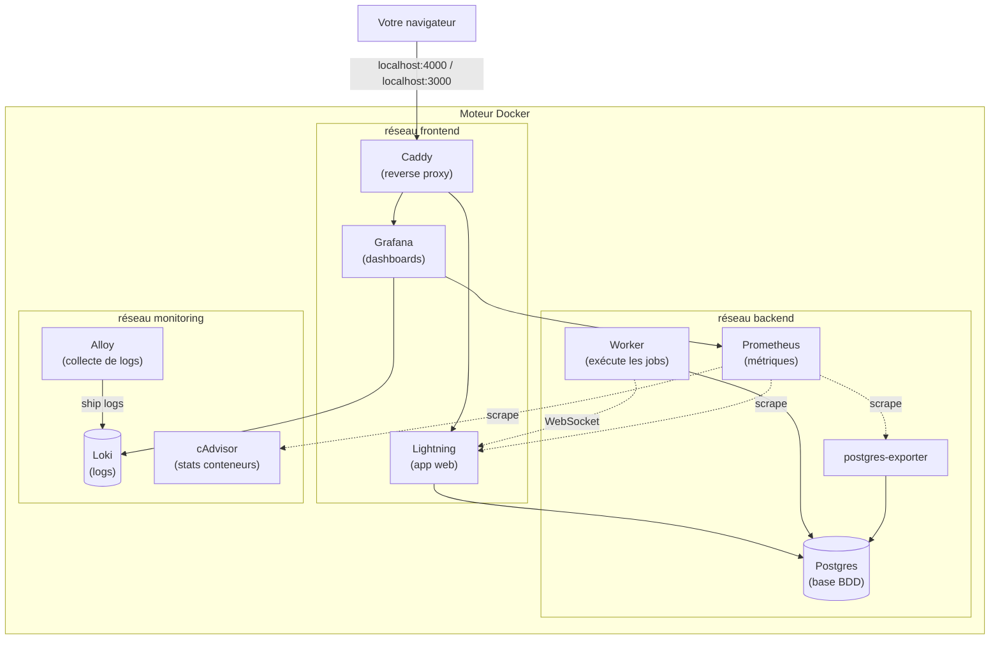

# Guide d'installation d'OpenFn

Une copie de la stack OpenFn Lightning à faire tourner sur votre propre machine. Même configuration que le déploiement local en production pour Madagascar, sauf que les images de monitoring viennent du Docker Hub public au lieu de `dhi.io`, donc aucun accès spécial n'est nécessaire.
 
À la fin de ce guide vous aurez :

- Lightning sur <http://localhost:4000>
- Les dashboards Grafana sur <http://localhost:3000>
- Un Worker connecté à Lightning, prêt à exécuter des jobs
- La stack de monitoring complète (Prometheus, Loki, Grafana, Alloy, cAdvisor)
- Une boîte Mailtrap qui reçoit les emails de Lightning (optionnel)
- Une compréhension de ce qu'est GitHub Sync et comment le configurer (optionnel)

## Comment utiliser ce guide

Lisez de haut en bas. Chaque section comporte des repères :

- ▶ **Étape à exécuter** : une commande ou une action à effectuer
- 💬 **Contexte** : ce qui se passe, utile à lire pendant qu'une commande tourne
- 🛟 **En cas de problème** : pannes typiques et solutions

Les sections marquées **OPTIONNEL** sont des ajouts que vous pouvez passer.

## Table des matières

1. [Vue d'ensemble de l'architecture](#1-vue-densemble-de-larchitecture)
2. [Prérequis](#2-prérequis)
3. [Cloner le dépôt](#3-cloner-le-dépôt)
4. [Générer les secrets](#4-générer-les-secrets)
5. [Démarrer la stack](#5-démarrer-la-stack)
6. [Créer le premier utilisateur](#6-créer-le-premier-utilisateur)
7. [Visite : l'interface Lightning](#7-visite--linterface-lightning)
8. [Visite : Grafana et le monitoring](#8-visite--grafana-et-le-monitoring)
9. [OPTIONNEL : Email via Mailtrap](#9-optionnel--email-via-mailtrap)
10. [OPTIONNEL : GitHub Sync](#10-optionnel--github-sync)
11. ["Qu'est-ce que je changerais en production ?"](#11-quest-ce-que-je-changerais-en-production-)
12. [Opérations quotidiennes (référence)](#12-opérations-quotidiennes-référence)
13. [Dépannage (référence)](#13-dépannage-référence)
14. [Tout recommencer à zéro (référence)](#14-tout-recommencer-à-zéro-référence)
15. [Annexe : commandes avancées](#15-annexe--commandes-avancées)
16. [Glossaire](#glossaire)
17. [FAQ](#faq)

## 1. Vue d'ensemble de l'architecture

💬 **Contexte :** Avant d'installer quoi que ce soit, voici ce qu'on va lancer. C'est exactement la même stack que sur le serveur Madagascar, sans la partie publique exposée à Internet.



Points clés :

- **Lightning** est l'application web OpenFn. C'est avec elle que les utilisateurs interagissent.
- **Worker** récupère les jobs depuis Lightning par WebSocket et les exécute.
- **Postgres** stocke tout : utilisateurs, projets, workflows, historique d'exécution.
- **Caddy** est un reverse proxy. C'est par lui que le navigateur communique avec Lightning et Grafana.
- La **stack de monitoring** (Prometheus, Loki, Grafana, Alloy, cAdvisor, postgres-exporter) est utile mais pas indispensable au fonctionnement de Lightning.

Sur le **serveur Madagascar en production**, il y a un reverse proxy externe supplémentaire qui gère le SSL et redirige `openfn.msppas.ne` vers ce Caddy. Localement, on saute cette partie.

## 2. Prérequis

Vous avez besoin de trois outils installés : Docker, OpenSSL et Git. Plus une machine raisonnable.

### 2.1 Configuration matérielle requise

- **Espace disque :** au moins 10 Go disponibles (les images Docker pèsent environ 3 Go, plus la base, les logs, les métriques).
- **RAM :** 8 Go minimum, 16 Go recommandé. La stack consomme environ 4 Go au repos.
- **OS :** macOS, Windows 10/11, ou une distribution Linux desktop.

### 2.2 Installer Docker

Docker est ce qui fait tourner Lightning et ses services associés. Nous utilisons **Docker Desktop**, qui regroupe le moteur Docker, la commande `docker compose`, et une interface graphique.

#### macOS

1. Allez sur <https://www.docker.com/products/docker-desktop/>
2. Cliquez sur **Download for Mac** et choisissez la version correspondant à votre puce :
   - **Apple Silicon** (M1/M2/M3/M4) pour les Mac de 2020 ou plus récents
   - **Intel chip** pour les Mac plus anciens

   Pour vérifier : **menu Apple → À propos de ce Mac**, regardez la ligne "Puce" ou "Processeur".

3. Ouvrez le fichier `.dmg` et glissez l'icône Docker dans Applications.
4. Lancez Docker depuis Applications. Acceptez les invites. Attendez que l'icône baleine 🐳 dans la barre de menus arrête de bouger.

> ⚠️ **Mac Apple Silicon :** Lightning et le Worker sont des images `linux/amd64`. Docker Desktop utilise Rosetta 2 (ou QEMU) pour les exécuter. Docker Desktop propose généralement d'installer Rosetta au premier lancement : acceptez. Sinon, lancez `softwareupdate --install-rosetta --agree-to-license` dans le Terminal.

#### Windows

1. Allez sur <https://www.docker.com/products/docker-desktop/>, cliquez sur **Download for Windows**.
2. Lancez l'installeur. Laissez **"Use WSL 2 instead of Hyper-V"** coché.
3. Redémarrez votre ordinateur.
4. Ouvrez Docker Desktop. Acceptez les invites. Attendez que l'icône baleine dans la barre des tâches arrête de bouger.

> 🪟 **Important pour Windows :** Toutes les commandes du terminal ci-dessous doivent être exécutées **dans WSL**, pas dans PowerShell ni dans l'Invite de commandes. Après avoir installé Docker Desktop, ouvrez **Windows Terminal** et choisissez une distribution WSL (Ubuntu par défaut). Restez dans ce terminal WSL pour la suite du guide.

#### Linux (Ubuntu / Debian)

```sh
curl -fsSL https://download.docker.com/linux/ubuntu/gpg | sudo gpg --dearmor -o /usr/share/keyrings/docker-archive-keyring.gpg
echo "deb [arch=$(dpkg --print-architecture) signed-by=/usr/share/keyrings/docker-archive-keyring.gpg] https://download.docker.com/linux/ubuntu $(lsb_release -cs) stable" | sudo tee /etc/apt/sources.list.d/docker.list > /dev/null

sudo apt-get update
sudo apt-get install -y docker-ce docker-ce-cli containerd.io docker-buildx-plugin docker-compose-plugin

sudo usermod -aG docker $USER
```

Déconnectez-vous puis reconnectez-vous pour que le changement de groupe s'applique.

### 2.3 Vérifier Docker

▶ **Étape à exécuter :** Dans un terminal :

```sh
docker --version
docker compose version
```

Vous devriez voir deux numéros de version. Si l'une des commandes répond `command not found`, Docker n'est pas correctement installé.

### 2.4 OpenSSL et Git

OpenSSL est déjà installé sur macOS et Linux. Sur Windows (WSL), il est inclus dans Ubuntu.

```sh
openssl version   # devrait afficher : OpenSSL 3.x.x
git --version     # devrait afficher : git version 2.x.x
```

Si Git n'est pas installé :

- **macOS :** `xcode-select --install`
- **Windows (WSL) :** `sudo apt-get install -y git`
- **Linux :** `sudo apt-get install -y git`

## 3. Cloner le dépôt

▶ **Étape à exécuter :** Choisissez un dossier (votre dossier home convient) et clonez :

```sh
cd ~
git clone https://github.com/OpenFn/madagascar-deployment-training.git
cd madagascar-deployment-training
```

À partir d'ici, toutes les commandes sont lancées depuis le dossier `madagascar-deployment-training/`.

💬 **Contexte :** Ce dépôt contient une copie pédagogique de la configuration Lightning utilisée en production sur le serveur Madagascar. Elle utilise des images Docker publiques (au lieu des images "hardened" de Madagascar) et embarque le script `generate_secrets` qui permet de partir de zéro. Aucun accès spécial requis.

> 💡 **S'authentifier auprès de GitHub.** Pour cloner un dépôt privé, votre Git local doit pouvoir prouver votre identité à GitHub. Deux options :
>
> - **HTTPS + Personal Access Token :** créez un token sur <https://github.com/settings/tokens> (scope `repo`), puis utilisez-le comme mot de passe quand Git vous le demande.
> - **SSH :** générez une paire de clés (`ssh-keygen -t ed25519`), ajoutez la clé publique sur <https://github.com/settings/keys>, puis clonez avec `git clone git@github.com:OpenFn/madagascar-deployment-training.git`.
>
> SSH est généralement plus simple à long terme.

## 4. Générer les secrets

Lightning a besoin de secrets cryptographiques pour fonctionner : un mot de passe Postgres, une clé de chiffrement pour les credentials stockés, une paire de clés RSA pour que le worker vérifie les tokens des jobs, etc. Ces secrets ne sont jamais commités dans Git, ils sont propres à chaque installation.

▶ **Étape à exécuter :**

```sh
./generate_secrets
```

💬 **Contexte :** Voici ce que le script vient de produire.

- `postgres/postgres_password.txt` : mot de passe alphanumérique aléatoire de 16 caractères pour la base de données Postgres.
- `worker/worker_runs_private_key.pem` + `worker_runs_public_key.pem` : paire de clés RSA de 2048 bits. Lightning signe les tokens de jobs avec la clé privée, le worker les vérifie avec la clé publique.
- `lightning/web.secrets.env` : un ensemble de secrets.
  - `PRIMARY_ENCRYPTION_KEY` chiffre les credentials stockés dans Lightning (clés d'API des systèmes partenaires, par exemple).
  - `SECRET_KEY_BASE` est le secret de session web de Phoenix.
  - `WORKER_SECRET` est un secret partagé entre Lightning et le Worker, utilisé pendant la poignée de main WebSocket.
  - `PROMEX_METRICS_ENDPOINT_TOKEN` protège l'endpoint Prometheus de Lightning.
- `worker/worker.secrets.env` : la moitié de `WORKER_SECRET` côté worker, plus la clé publique RSA.
- `grafana/grafana.secrets.env` : mot de passe admin pour Grafana.
- `prometheus/prometheus_lightning_token.txt` : le même token que `PROMEX_METRICS_ENDPOINT_TOKEN` pour que Prometheus puisse scraper Lightning.

> 📝 **Note :** le script copie aussi `web.env.example` → `web.env`, `worker.env.example` → `worker.env`, `grafana.env.example` → `grafana.env`. Ce sont les fichiers de configuration non-sensibles. Vous les éditerez plus tard pour activer des fonctionnalités optionnelles.

> 🔐 **Important :** ces fichiers générés sont listés dans `.gitignore` et ne seront jamais commités, même si vous poussez le dépôt.

La dernière ligne affichée par le script contient votre **mot de passe admin Grafana**. Notez-le quelque part de sûr.

> ✅ **Rien d'autre à brancher manuellement.** Le script a écrit chaque valeur générée directement dans les fichiers d'environnement que `docker-compose.yml` lit (`lightning/web.secrets.env`, `worker/worker.secrets.env`, `postgres/postgres_password.txt`, etc.). Démarrer la stack chargera ces valeurs automatiquement.

## 5. Démarrer la stack

▶ **Étape à exécuter :**

```sh
docker compose up -d
```

Le premier téléchargement représente 2 à 3 Go au total. Profitez-en pour relire la section §1 et comprendre le rôle de chaque conteneur.

💬 **Contexte pendant le téléchargement :**

- Cette seule commande télécharge et démarre **11 conteneurs**. Docker Compose lit `docker-compose.yml`, qui inclut quatre fichiers compose dans `compose/` : un pour Lightning + Postgres + migrations, un pour le worker, un pour le reverse proxy Caddy, un pour la stack de monitoring.
- Le conteneur `migration` est spécial. Il s'exécute une seule fois, applique les migrations de base de données en attente, puis s'arrête. Lightning attend qu'il se termine avec succès avant de démarrer. C'est pour cela qu'au premier démarrage, Lightning met un peu plus de temps à apparaître.

Quand le téléchargement est terminé, vérifiez l'état :

```sh
docker compose ps
```

Vous devriez voir 11 services dans l'état `Up`. Les deux importants sont `lightning` et `worker`, tous les deux doivent atteindre `(healthy)` en moins d'une minute.

Pour suivre les logs en direct :

```sh
docker compose logs -f lightning
```

`Ctrl+C` pour arrêter de suivre. Le conteneur continue de tourner.

🛟 **En cas de problème :**

- `Bind for 0.0.0.0:4000 failed: port is already allocated` : un autre processus ou une autre stack Docker occupe le port 4000. Voir §13.
- `lightning` bloqué sur `(health: starting)` : vérifiez `docker compose logs migration`. Si les migrations ont échoué, Lightning ne démarrera pas.

## 6. Créer le premier utilisateur

▶ **Étape à exécuter :** Ouvrez <http://localhost:4000> dans votre navigateur.

Sur une installation fraîche, Lightning affiche un **formulaire d'inscription**. Le premier utilisateur à s'inscrire devient automatiquement **superutilisateur** : il a tous les droits d'administration sur l'instance.

Remplissez :

- Prénom et nom
- Email (n'importe lequel, il n'a pas besoin d'être réel si vous n'avez pas configuré le SMTP)
- Mot de passe (au moins 12 caractères)

Cliquez sur **Sign up**.

💬 **Contexte :**

- Vous êtes maintenant connecté en tant que superutilisateur.
- En production vous voudriez un vrai email, parce que c'est par là que passe la réinitialisation de mot de passe. Comme nous n'avons pas encore configuré l'email, notez bien votre mot de passe.
- Pour créer d'autres comptes d'instance plus tard, allez dans **Admin Menu → Users → New User** (en haut à gauche de la sidebar). Pour inviter un utilisateur sur un projet précis, c'est différent : **Settings → Collaboration → Add Collaborator(s)** dans le projet en question.

## 7. Visite : l'interface Lightning

Une fois connecté, vous voyez la liste de vos projets. Créez-en un pour explorer ("Démo Formation" par exemple).

La sidebar de gauche, dans un projet, contient cinq entrées :

1. **Workflows** : la liste des workflows du projet et le canvas pour les construire. Un workflow est un trigger plus une suite de steps connectés.
2. **Channels** : les webhooks et autres canaux d'entrée du projet.
3. **Sandboxes** : sous-projets cloisonnés du projet courant, pratiques pour expérimenter sans toucher la prod.
4. **History** : la liste des exécutions (runs). Chaque run a son dataclip d'entrée, sa sortie, ses logs.
5. **Settings** : tous les paramètres du projet, organisés en onglets.

Les onglets de **Settings** :

- **Setup** : nom du projet, description, suppression.
- **Credentials** : credentials du projet, chiffrées au repos avec votre `PRIMARY_ENCRYPTION_KEY`.
- **Collections** : stockage clé/valeur partagé entre runs.
- **Webhook Security** : signatures et règles d'authentification des webhooks.
- **Collaboration** : membres du projet et leurs rôles. C'est ici que vous invitez de nouveaux membres ("Add Collaborator(s)").
- **Security** : chiffrement, audit.
- **Sync to GitHub** : voir §10.
- **Data Storage** : politiques de rétention.
- **History Exports** : exports CSV/JSON de l'historique.

L'**Admin Menu** dans la sidebar (visible seulement aux superutilisateurs) donne accès à la gestion système : Projects, Users, Authentication, Audit, Collections.

💬 **Astuce pour voir un workflow s'exécuter :**

1. Dans le workflow editor, ajoutez un déclencheur **Webhook** et un step avec un adaptateur basique comme `common` ou `http`.
2. Enregistrez le workflow.
3. Cliquez sur le node de déclenchement pour récupérer l'URL du webhook.
4. Dans un terminal : `curl -X POST <url-du-webhook> -d '{"hello": "world"}'`.
5. Retournez dans Lightning, onglet **History** : le run apparaît avec son input et son output.

## 8. Visite : Grafana et le monitoring

▶ **Étape à exécuter :** Ouvrez <http://localhost:3000>.

Connectez-vous avec :

- Username : `admin`
- Password : le mot de passe Grafana affiché à la fin de `./generate_secrets` (aussi stocké dans `grafana/grafana.secrets.env` sous la clé `GF_SECURITY_ADMIN_PASSWORD`).

💬 **Contexte :**

Lightning embarque une stack de monitoring déjà câblée. C'est ce qui tourne en production sur le serveur Madagascar.

1. **Dashboards → Browse**, vous trouverez les dashboards auto-provisionnés :
   - `web` : requêtes HTTP, latence, taux d'erreur de Lightning.
   - `worker` : exécution des jobs, profondeur de la file, durée des runs.
   - `prom_ex_application` : métriques applicatives PromEx.
   - `prom_ex_beam` : machine virtuelle Erlang (mémoire, processus, schedulers).
   - `prom_ex_ecto` : requêtes en base.
   - `prom_ex_oban` : jobs Oban (file de tâches en arrière-plan).
   - `prom_ex_phoenix` et `prom_ex_phoenix_live_view` : couche web.
   - `ancillary_services` : CPU, mémoire, disque, réseau pour chaque conteneur (via cAdvisor).

2. **Drilldown → Logs** : Alloy expédie les logs de chaque conteneur vers Loki. Vous pouvez filtrer par conteneur, faire des recherches, choisir une fenêtre temporelle. Filtrez sur `lightning` pour voir ce qui se passe côté app.

3. **Connections → Data sources** : Prometheus et Loki sont déjà configurés comme sources de données.

💬 **Récapitulatif :**

- **Prometheus** scrape les métriques toutes les 15 secondes depuis Lightning, postgres-exporter, cAdvisor.
- **Loki** stocke les logs.
- **Alloy** découvre les conteneurs Docker et envoie leurs logs à Loki.
- **cAdvisor** collecte les métriques par conteneur.
- **Grafana** est la couche d'affichage par dessus.

En production, Grafana est exposé sur `grafana.msppas.ne` derrière SSL. Localement on tape `localhost:3000`.

## 9. OPTIONNEL : Email via Mailtrap

Lightning envoie quelques emails dans des cas précis (voir §9.5). Pour l'instant on a tourné sans email, et c'est très bien : Lightning fonctionne, le premier utilisateur s'inscrit lui-même.

Si vous voulez activer l'email, le plus simple en formation est **Mailtrap Sandbox** : un service gratuit qui capture les emails dans une fausse boîte de réception pour que vous puissiez les visualiser, sans les livrer pour de vrai. Pas de domaine à configurer.

> 💡 **Astuce :** cette section est optionnelle. Vous pouvez la sauter et y revenir plus tard.

### 9.1 Créer un compte Mailtrap

1. Allez sur <https://mailtrap.io/register/signup> et créez un compte gratuit (la connexion Google fonctionne).
2. Après l'inscription, Mailtrap peut vous demander "Quel domaine allez-vous utiliser pour envoyer des emails ?". Cliquez sur **Skip Step**, nous voulons tester, pas envoyer pour de vrai.
3. Depuis le dashboard, trouvez la carte orange **Email Sandbox**, cliquez sur **Start Testing**.
4. Vous atterrissez dans **My Sandbox**. L'onglet **Integration** est sélectionné par défaut, choisissez **SMTP** dans le sous-onglet.
5. La boîte **Credentials** vous donne quatre valeurs :
   - **Host** : `sandbox.smtp.mailtrap.io`
   - **Port** : utilisez `587`
   - **Username** : une chaîne hexadécimale
   - **Password** : cliquez sur le mot de passe masqué pour le révéler

### 9.2 Brancher Mailtrap dans Lightning

Ouvrez `lightning/web.env` dans votre éditeur. En bas du fichier vous voyez un bloc Email commenté. Décommentez les six lignes et remplissez vos credentials Mailtrap :

```ini
MAIL_PROVIDER=smtp
SMTP_RELAY=sandbox.smtp.mailtrap.io
SMTP_PORT=587
SMTP_TLS=true
SMTP_USERNAME=<votre-mailtrap-username>
SMTP_PASSWORD=<votre-mailtrap-password>
EMAIL_ADMIN=no-reply@openfn.local
```

▶ **Étape à exécuter :** Recréez le conteneur Lightning pour qu'il prenne en compte la nouvelle config :

```sh
docker compose up -d --force-recreate lightning
```

💬 **Contexte :** `docker compose restart` ne suffit pas ici. Docker ne recharge les fichiers d'environnement que lorsqu'un conteneur est **recréé** (`up -d --force-recreate`), pas redémarré. C'est l'un des pièges les plus courants.

### 9.3 Vérifier que ça marche

Une bonne façon de tester : faites un mot de passe oublié sur l'écran de connexion (déconnectez-vous d'abord, puis "Forgot your password?"). Lightning envoie un email de réinitialisation à l'adresse saisie.

Basculez vers votre onglet Mailtrap. En quelques secondes, l'email apparaît dans la boîte. Cliquez dessus pour voir le corps, les en-têtes, et même le lien de réinitialisation.

### 9.4 Le même branchement pour Grafana (optionnel)

Pour que Grafana envoie aussi des emails d'alerte, éditez `grafana/grafana.env` :

```ini
GF_SMTP_ENABLED=true
GF_SMTP_HOST=sandbox.smtp.mailtrap.io:587
GF_SMTP_USER=<votre-mailtrap-username>
GF_SMTP_FROM_ADDRESS=no-reply@openfn.local
GF_SMTP_FROM_NAME=OpenFn Grafana Alerts
```

Et `grafana/grafana.secrets.env` :

```ini
GF_SMTP_PASSWORD=<votre-mailtrap-password>
GF_SECURITY_ADMIN_PASSWORD=<gardez ce qui est déjà là>
```

```sh
docker compose up -d --force-recreate grafana
```

### 9.5 Quels emails Lightning envoie-t-il ?

Lightning a un total de 9 types d'emails. Si rien dans cette liste ne vous est utile aujourd'hui, vous pouvez très bien laisser l'email désactivé.

- **Confirmation d'email à l'inscription** : à un nouvel utilisateur qui s'inscrit, pour vérifier son adresse.
- **Confirmation d'email pour un compte créé par un admin** : variante de l'email ci-dessus, quand le compte est créé par un superutilisateur.
- **Notification d'ajout à un projet** : à un utilisateur existant ajouté à un projet.
- **Invitation à rejoindre un projet** : à un email qui n'a pas encore de compte sur l'instance, pour l'inviter à en créer un et rejoindre un projet.
- **Réinitialisation de mot de passe** : quand un utilisateur clique sur "mot de passe oublié".
- **Instructions pour changer d'email** : lien de confirmation envoyé à la nouvelle adresse.
- **Avertissement de changement d'email** : email envoyé à l'ancienne adresse pour signaler la demande de changement.
- **Notifications digest de projet** : résumé périodique des runs (si activé sur le projet).
- **Transfert de credential** : confirmation et notification quand une credential est transférée à un autre utilisateur.

### 9.6 Passer à un vrai fournisseur SMTP

Mailtrap est parfait pour tester, mais en production vous voulez que les emails arrivent vraiment. Voici les configurations pour les fournisseurs courants. Dans tous les cas SMTP, seuls les `SMTP_RELAY`, `SMTP_PORT`, `SMTP_USERNAME`, `SMTP_PASSWORD` changent.

#### SendGrid

```ini
MAIL_PROVIDER=smtp
SMTP_RELAY=smtp.sendgrid.net
SMTP_PORT=587
SMTP_TLS=true
SMTP_USERNAME=apikey
SMTP_PASSWORD=<votre clé d'API SendGrid>
```

`SMTP_USERNAME` est littéralement la chaîne `apikey`, c'est la convention SendGrid. La vraie clé va dans `SMTP_PASSWORD`.

#### AWS SES

```ini
MAIL_PROVIDER=smtp
SMTP_RELAY=email-smtp.eu-west-1.amazonaws.com   # adaptez la région
SMTP_PORT=587
SMTP_TLS=true
SMTP_USERNAME=<votre SMTP username SES>
SMTP_PASSWORD=<votre SMTP password SES>
```

Les credentials SMTP de SES sont **différents** de vos credentials AWS habituels. Vous les générez depuis la console SES (IAM → Create SMTP credentials). Pensez aussi à vérifier votre domaine d'envoi dans SES avant de l'utiliser.

#### OVH (c'est ce que Madagascar utilise en production)

```ini
MAIL_PROVIDER=smtp
SMTP_RELAY=ssl0.ovh.net
SMTP_PORT=587
SMTP_TLS=true
SMTP_USERNAME=<votre adresse email OVH complète>
SMTP_PASSWORD=<mot de passe de la boîte email>
EMAIL_ADMIN=<la même adresse>
```

#### Mailgun

Lightning a un adaptateur Mailgun natif (recommandé) plutôt que d'utiliser SMTP. Le bloc de configuration est différent :

```ini
MAIL_PROVIDER=mailgun
MAILGUN_API_KEY=<votre clé d'API Mailgun>
MAILGUN_DOMAIN=<votre domaine Mailgun, ex: mg.exemple.org>
EMAIL_ADMIN=no-reply@exemple.org
```

Mailgun peut aussi être utilisé via SMTP standard (`MAIL_PROVIDER=smtp` avec `SMTP_RELAY=smtp.mailgun.org`), mais l'adaptateur natif est plus simple.

Après modification :

```sh
docker compose up -d --force-recreate lightning
```

### 9.7 Délivrabilité en production : SPF, DKIM, DMARC

Si vous envoyez des emails depuis votre propre domaine (par exemple `noreply@msppas.ne`), Gmail, Outlook et Yahoo vont les filtrer en spam, ou les bloquer carrément, sans configuration DNS appropriée. Vous devez configurer trois enregistrements DNS sur votre domaine :

| Type | Hôte                 | Valeur                                                          |
| ---- | -------------------- | --------------------------------------------------------------- |
| TXT  | `@`                  | `v=spf1 include:<fournisseur> ~all`                             |
| TXT  | `mail._domainkey`    | `v=DKIM1; k=rsa; p=<clé publique fournie par le fournisseur>`   |
| TXT  | `_dmarc`             | `v=DMARC1; p=quarantine; rua=mailto:admin@votre-domaine`        |

**SPF** déclare quels serveurs ont le droit d'envoyer du courrier pour votre domaine. **DKIM** signe cryptographiquement chaque email pour prouver qu'il vient bien de chez vous. **DMARC** indique aux serveurs destinataires quoi faire des emails qui échouent SPF/DKIM.

Chaque fournisseur SMTP (SendGrid, SES, OVH, Mailgun) vous fournit la valeur exacte à mettre dans les enregistrements SPF et DKIM. Cherchez "DNS configuration" ou "domain authentication" dans leur documentation.

> 💡 **Astuce :** pour vérifier que tout est en place, utilisez <https://mxtoolbox.com> ou <https://www.mail-tester.com>. Envoyez un email depuis Lightning vers l'adresse de test, vous obtiendrez un rapport détaillé.

### 9.8 Déboguer les problèmes d'email

#### Aucun email n'arrive

1. Vérifier les logs de Lightning :

   ```sh
   docker compose logs lightning | grep -i -E "swoosh|smtp|mail"
   ```

   Cherchez `:network_failure`, `:authentication_failed`, `connection refused`.

2. Tester la connectivité SMTP depuis le conteneur :

   ```sh
   docker compose exec lightning sh -c "echo QUIT | nc -w 3 sandbox.smtp.mailtrap.io 587"
   ```

   Vous devriez voir `220 ... ESMTP`. Sinon c'est un problème réseau ou pare-feu.

3. Vérifier que les variables sont bien chargées :

   ```sh
   docker compose exec lightning env | grep SMTP
   ```

   Si la sortie est vide ou contient encore des placeholders, vous avez probablement oublié `--force-recreate`.

#### Authentication failed

Le username ou le password est incorrect, ou le compte SMTP n'autorise pas l'application. Pour OVH par exemple, vérifiez que vous utilisez bien le mot de passe **de la boîte email**, pas votre mot de passe de manager OVH.

#### Les emails arrivent dans les spams

C'est presque toujours un problème de DNS (voir §9.7). Utilisez <https://www.mail-tester.com> pour un diagnostic détaillé.

#### "Sender address rejected"

Le `EMAIL_ADMIN` doit correspondre à un domaine que vous avez le droit d'utiliser chez votre fournisseur. SendGrid, SES et OVH vérifient cela.

## 10. OPTIONNEL : GitHub Sync

> 💡 **Astuce :** Configurer GitHub Sync de bout en bout demande de créer une vraie GitHub App. Comptez 15-20 minutes la première fois. Les étapes ci-dessous décrivent le processus, faites-les sur votre temps libre quand vous en aurez vraiment besoin.

💬 **Contexte :**

GitHub Sync permet de relier un projet Lightning à un dépôt GitHub :

- Quand quelqu'un modifie un workflow dans Lightning, le changement est poussé vers le dépôt.
- Quand quelqu'un fait un commit sur le dépôt, le changement peut être tiré dans Lightning.

Pourquoi c'est utile :

- **Versionnage** des workflows.
- **Revue par les pairs** via les pull requests.
- **Récupération en cas de désastre** : si Lightning est effacé, les workflows restent dans GitHub.
- **Migration** : déplacer un projet vers une autre instance Lightning devient un clone plus sync.

### 10.1 Créer une GitHub App

1. Allez sur <https://github.com/settings/apps/new> (ou `https://github.com/organizations/VOTRE_ORG/settings/apps/new` si vous voulez l'app dans une organisation).
2. Remplissez :
   - **GitHub App name** : un nom unique, par exemple `openfn-lightning-madagascar`.
   - **Homepage URL** : `https://votre-domaine-lightning` (en local, `http://localhost:4000`).
   - **Callback URL** : `https://votre-domaine-lightning/oauth/github/callback`.
   - **Setup URL** (sous "Post installation") : `https://votre-domaine-lightning/setup_vcs`. Cochez **Redirect on update**.
   - Dans la section "Identifying and authorizing users", **décochez** "Expire user authorization tokens", "Request user authorization (OAuth) during installation" et "Enable Device Flow". Lightning ne les utilise pas.
3. Dans **Webhook**, décochez **Active**. Lightning n'utilise pas le webhook GitHub, il interroge GitHub directement quand il en a besoin.
4. Dans **Repository permissions**, mettez :

   | Permission | Niveau |
   | ---------- | ------ |
   | Actions    | Read and write |
   | Contents   | Read and write |
   | Metadata   | Read-only |
   | Secrets    | Read and write |
   | Workflows  | Read and write |

5. Dans **Where can this GitHub App be installed**, choisissez **Only on this account**.
6. Cliquez sur **Create GitHub App**.

### 10.2 Générer les credentials

Sur la page de l'app que vous venez de créer :

1. Notez l'**App ID** et le **Client ID** affichés en haut.
2. Plus bas, cliquez sur **Generate a new client secret**. Copiez-le.
3. Encore plus bas, cliquez sur **Generate a private key**. Un fichier `.pem` se télécharge.

### 10.3 Encoder la clé privée en base64

```sh
base64 -i votre-app.private-key.pem | tr -d '\n'
```

Copiez la sortie. C'est la valeur de `GITHUB_CERT` ci-dessous.

### 10.4 Éditer `lightning/web.secrets.env`

Décommentez le bloc GitHub en bas du fichier et remplissez :

```ini
GITHUB_APP_ID=<App ID de l'étape 10.2>
GITHUB_APP_NAME=<le nom de l'app en minuscules, espaces remplacés par des tirets>
GITHUB_APP_CLIENT_ID=<Client ID>
GITHUB_APP_CLIENT_SECRET=<Client secret>
GITHUB_CERT=<sortie base64 de l'étape 10.3>
REPO_CONNECTION_SIGNING_SECRET=<lancer `openssl rand -base64 32` pour générer>
```

`GITHUB_APP_NAME` est le slug public de l'app (le nom dans l'URL `github.com/apps/<slug>`). Si votre app s'appelle "OpenFn Lightning Madagascar", le slug est `openfn-lightning-madagascar`.

### 10.5 Recréer Lightning

```sh
docker compose up -d --force-recreate lightning
```

### 10.6 Installer la GitHub App sur un dépôt

1. Sur la page de l'app, cliquez sur **Install App**.
2. Choisissez le compte ou l'organisation où installer.
3. Choisissez le dépôt (ou "All repositories").
4. Cliquez sur **Install**.

### 10.7 Connecter un projet Lightning à un dépôt

1. Dans Lightning, ouvrez le projet.
2. **Settings → Sync to GitHub**.
3. Cliquez sur **Connect your OpenFn account to GitHub**, autorisez l'app.
4. Choisissez le dépôt, la branche, et confirmez.

### Stratégies de branches multi-environnements

Si vous gérez plusieurs instances Lightning (dev, staging, production), une bonne pratique est d'associer une branche du dépôt à chaque environnement :

- `dev` ← projet sur l'instance Lightning de développement
- `staging` ← projet sur l'instance Lightning de staging
- `main` ← projet sur l'instance Lightning de production

Le flux typique :

1. Un développeur modifie un workflow sur l'instance dev, Lightning pousse sur la branche `dev`.
2. Une fois validé, ouverture d'une pull request `dev` → `staging`.
3. Après revue et merge, la branche `staging` est sync sur l'instance staging.
4. Tests intégrés, puis pull request `staging` → `main`.
5. Merge sur `main`, l'instance production récupère les changements.

Cela donne une vraie discipline de release pour les workflows.

### Erreurs courantes

#### "Version Control is not configured for this Lightning instance"

Lightning ne voit pas vos variables GitHub. Vérifiez que les six variables (`GITHUB_APP_ID`, `GITHUB_APP_NAME`, `GITHUB_APP_CLIENT_ID`, `GITHUB_APP_CLIENT_SECRET`, `GITHUB_CERT`, `REPO_CONNECTION_SIGNING_SECRET`) sont bien dans `lightning/web.secrets.env`, puis recréez le conteneur :

```sh
docker compose up -d --force-recreate lightning
```

#### "Resource not accessible by integration"

La GitHub App n'a pas les permissions nécessaires sur le dépôt cible. Vérifiez :

1. Sur `https://github.com/settings/apps/<votre-app>/permissions`, les permissions doivent correspondre exactement à la table de §10.1.
2. Sur `https://github.com/settings/installations`, cliquez sur **Configure** pour votre app et vérifiez que le dépôt cible est bien inclus (ou que "All repositories" est sélectionné).
3. Réinitialiser les tokens OAuth et réautoriser :

   ```sh
   docker compose exec postgres psql -U lightning -c "UPDATE users SET github_oauth_token = NULL;"
   docker compose exec postgres psql -U lightning -c "DELETE FROM project_repo_connections;"
   ```

   Puis recommencez §10.7.

#### "redirect_uri is not associated with this application"

L'URL de callback configurée dans la GitHub App ne correspond pas exactement à celle que Lightning génère. Elle doit être strictement `https://votre-domaine/oauth/github/callback` (ou `http://localhost:4000/oauth/github/callback` en local). Vérifiez les slashs, le scheme, le sous-domaine.

## 11. "Qu'est-ce que je changerais en production ?"

Si on vous donne cette stack et qu'on vous dit "mets ça sur un vrai serveur, vrai domaine, vrais utilisateurs", voici les quatre choses à toucher.

### 11.1 La version de Lightning

Dans `compose/lightning.yml`, première ligne :

```yaml
x-lightning-image: &lightning-image openfn/lightning:v2.16.4
```

Pour mettre à jour, changez le tag (`v2.17.0` par exemple), puis :

```sh
docker compose pull
docker compose up -d
```

Le service `migration` tourne en premier, applique les nouvelles migrations de base, et s'arrête. Lightning ne démarre que si les migrations réussissent.

La dernière version stable est sur <https://hub.docker.com/r/openfn/lightning/tags>.

### 11.2 URL_HOST, URL_PORT, URL_SCHEME, ORIGINS

Dans `lightning/web.env` :

```ini
URL_HOST=localhost
URL_PORT=4000
URL_SCHEME=http
ORIGINS=//localhost:4000
```

En production, ces valeurs deviennent votre vrai domaine :

```ini
URL_HOST=openfn.msppas.ne
URL_PORT=443
URL_SCHEME=https
ORIGINS=//openfn.msppas.ne
```

`URL_HOST`, `URL_PORT` et `URL_SCHEME` sont utilisés pour générer les URLs absolues dans les emails, les redirections et les configurations CORS. `ORIGINS` autorise les requêtes WebSocket entrantes : c'est ce que le worker utilise pour se connecter.

Après modification : `docker compose up -d --force-recreate lightning`.

### 11.3 Le fournisseur de mail

On a utilisé Mailtrap dans §9. En production, vous remplacez par un vrai fournisseur (SendGrid, AWS SES, OVH, Mailgun, voir §9.6). Le schéma de configuration est le même, seules les valeurs changent.

### 11.4 Les images de monitoring

Dans `compose/monitoring.yml` on utilise des images publiques (`grafana/grafana`, `prom/prometheus`, etc.). Le serveur Madagascar en production utilise des **Docker Hardened Images** (DHI) depuis `dhi.io/*`. Même logiciel, mais avec des builds durcis à surface d'attaque plus réduite.

Pour basculer, remplacez chaque `grafana/grafana:X.Y.Z` par `dhi.io/grafana:X.Y.Z-debian13`, puis faites `docker login` avec un compte Docker Hub approuvé pour DHI, puis `docker compose pull && docker compose up -d`.

> 📝 **Note :** l'accès à DHI nécessite d'être ajouté à la liste blanche de l'abonnement DHI d'OpenFn. Parlez-en à votre contact OpenFn.

## 12. Opérations quotidiennes (référence)

```sh
docker compose up -d                                # Tout démarrer
docker compose down                                 # Tout arrêter, les données sont conservées
docker compose ps                                   # Voir ce qui tourne
docker compose logs -f lightning                    # Suivre les logs de Lightning
docker compose logs -f worker                       # Suivre les logs du Worker
docker compose restart lightning                    # Redémarrer (ne recharge PAS les .env)
docker compose up -d --force-recreate lightning     # Recréer (recharge les .env)
```

## 13. Dépannage (référence)

### Le port 4000 (ou 3000) est déjà utilisé

Quelque chose d'autre sur votre machine occupe ce port, en général une autre stack Docker oubliée.

```sh
docker ps --format 'table {{.Names}}\t{{.Ports}}'
```

Si c'est une autre stack `lightning` ou `grafana`, arrêtez-la :

```sh
docker compose -f /chemin/vers/cette/stack/docker-compose.yml down
```

Si rien dans Docker n'utilise ce port :

```sh
lsof -nP -iTCP:4000 -sTCP:LISTEN   # macOS / Linux
```

Terminez ce processus, ou changez le port d'écoute (éditez `compose/rp.internal.yml`).

### Lightning ne démarre pas : "password authentication failed for user lightning"

Cela arrive quand vous avez régénéré les secrets mais que le volume de données de Postgres a encore l'ancien mot de passe.

Préserver les données (recommandé) :

```sh
NEW_PASS=$(cat postgres/postgres_password.txt)
docker exec openfn-postgres-1 psql -U lightning -c "ALTER USER lightning PASSWORD '${NEW_PASS}';"
docker compose up -d --force-recreate lightning worker
```

Destructif (efface la base) :

```sh
docker compose down -v
docker compose up -d
```

### Le Worker ne prend pas les jobs

```sh
docker compose logs worker
```

Causes courantes :

- `WORKER_SECRET` qui diffère entre `lightning/web.secrets.env` et `worker/worker.secrets.env`. Relancez `./generate_secrets`.
- Lightning n'a pas fini de démarrer. Attendez 30 secondes et `docker compose ps`.

### Grafana affiche "No data" sur les dashboards de conteneurs

cAdvisor échoue parfois à se connecter au docker-socket-proxy au démarrage.

```sh
docker compose restart cadvisor
```

### `localhost:4000` répond "Connection refused"

```sh
docker compose ps | grep -E "lightning|proxy"
```

Les deux doivent être à `Up`. Si `proxy` échoue, regardez ses logs : `docker compose logs proxy`.

### Les modifications de fichier .env ne prennent pas effet

`docker compose restart` ne **recharge pas** les fichiers `.env`. Utilisez toujours :

```sh
docker compose up -d --force-recreate <service>
```

## 14. Tout recommencer à zéro (référence)

Si la stack part en vrille et que vous voulez un point de départ vraiment propre :

```sh
# Tout arrêter et supprimer les volumes de données
docker compose down -v

# Supprimer les secrets générés (les modèles .example sont conservés)
rm -f lightning/web.env lightning/web.secrets.env
rm -f worker/worker.env worker/worker.secrets.env
rm -f worker/worker_runs_private_key.pem worker/worker_runs_public_key.pem
rm -f grafana/grafana.env grafana/grafana.secrets.env
rm -f postgres/postgres_password.txt postgres/postgres_exporter.secrets.env
rm -f prometheus/prometheus_lightning_token.txt

# Régénérer et redémarrer
./generate_secrets
docker compose up -d
```

Vous repartez de §4.

## 15. Annexe : commandes avancées

Vous n'en aurez pas besoin pour le parcours normal, mais c'est utile à connaître.

### Créer un superutilisateur en ligne de commande

Si l'inscription web est cassée ou indisponible :

```sh
docker compose exec lightning /app/bin/lightning rpc \
  'Lightning.Accounts.register_superuser(%{email: "admin@exemple.org", password: "votremotdepasse123456", first_name: "Admin", last_name: "User"}) |> IO.inspect()'
```

Notez que `register_superuser/1` ne marque pas l'email comme confirmé. Pour activer le compte immédiatement (utile sans email configuré) :

```sh
docker compose exec lightning /app/bin/lightning rpc \
  'user = Lightning.Accounts.get_user_by_email("admin@exemple.org"); user |> Ecto.Changeset.change(%{confirmed_at: DateTime.utc_now() |> DateTime.truncate(:second)}) |> Lightning.Repo.update()'
```

### Sauvegarder la base de données

```sh
docker exec -t openfn-postgres-1 pg_dump -U lightning lightning | gzip > backup.sql.gz
```

### Restaurer la base de données

```sh
docker compose stop lightning worker
gunzip -c backup.sql.gz | docker exec -i openfn-postgres-1 psql -U lightning lightning
docker compose start lightning worker
```

### Inspecter Postgres directement

```sh
docker exec -it openfn-postgres-1 psql -U lightning lightning
```

### Inspecter les cibles Prometheus

```sh
docker exec openfn-prometheus-1 wget -qO- http://localhost:9090/api/v1/targets
```

## Glossaire

Termes que vous rencontrerez en utilisant Lightning. Pratique à partager avec un nouveau membre de l'équipe.

**Adaptor (adaptateur)** : module qui sait comment parler à un système externe. Par exemple, l'adaptateur `dhis2` sait faire des appels d'API DHIS2, l'adaptateur `http` fait des appels HTTP génériques. Chaque step d'un workflow utilise un adaptateur. Liste complète sur <https://docs.openfn.org/adaptors>.

**Channel** : un point d'entrée du projet (webhook, par exemple). Listé dans l'onglet **Channels** de la sidebar du projet.

**Collection** : stockage clé/valeur intégré à Lightning, utilisable depuis les workflows pour partager de l'état entre runs (par exemple un "dernier ID synchronisé").

**Credential** : identifiants d'authentification (clé d'API, mot de passe, token OAuth) stockés de manière chiffrée dans Lightning. Une credential est attachée à un step pour lui donner l'accès au système distant.

**Dataclip** : une donnée JSON qui circule à travers un workflow. Chaque step lit un dataclip d'entrée et produit un dataclip de sortie. Les dataclips sont conservés pour permettre l'audit et le rejeu.

**Job** : le code JavaScript exécuté par un step.

**Project (projet)** : un espace de travail dans Lightning. Chaque projet a ses propres workflows, credentials, membres et synchronisation GitHub. C'est l'unité d'organisation principale.

**Run (exécution)** : une exécution complète d'un workflow, du déclencheur jusqu'au dernier step. Chaque run est conservé dans l'historique avec ses dataclips et ses logs. Visible dans l'onglet **History** de la sidebar du projet.

**Sandbox** : un sous-projet cloisonné d'un projet existant, qui hérite de certaines ressources du parent. Utile pour expérimenter.

**Step (étape)** : une boîte dans un workflow. Elle a un adaptateur, un job (code JS) et éventuellement une credential. Un workflow enchaîne plusieurs steps.

**Superuser / Admin / Editor / Viewer** : les rôles utilisateur dans Lightning. **Superuser** : admin de l'instance, peut gérer tous les projets. Les autres rôles (admin, editor, viewer) sont définis au niveau du projet.

**Trigger (déclencheur)** : ce qui démarre un workflow. Trois types : **webhook** (appel HTTP entrant), **cron** (planifié), **kafka** (consomme un topic Kafka).

**Webhook** : un endpoint HTTP exposé par Lightning. Quand un système externe fait `POST` sur l'URL, le workflow associé démarre avec le body du POST comme dataclip d'entrée.

**Worker** : service séparé qui exécute les jobs. Lightning lui envoie les runs à exécuter via WebSocket. Vous pouvez lancer plusieurs workers en parallèle pour augmenter le débit.

**Workflow** : une suite de steps qui forment un processus complet, avec un déclencheur en début. Par exemple : "à chaque webhook DHIS2, transformer les données et les pousser dans CommCare".

### Termes techniques d'infrastructure

**Caddy** : reverse proxy. Termine les connexions HTTP entrantes et les redirige vers Lightning ou Grafana selon le port.

**cAdvisor** : outil Google qui collecte les métriques au niveau conteneur (CPU, RAM, disque, réseau). Affichées dans le dashboard `ancillary_services`.

**Alloy** : agent de collecte de logs (anciennement Grafana Agent). Découvre les conteneurs Docker et envoie leurs logs à Loki.

**BEAM** : la machine virtuelle d'Erlang sur laquelle tourne Elixir (et donc Lightning). Les dashboards `prom_ex_beam` exposent ses métriques.

**Ecto** : bibliothèque Elixir d'accès aux bases de données. Le dashboard `prom_ex_ecto` montre les métriques de requêtes.

**Loki** : stockage de logs structuré. Indexe les logs par labels, pas par contenu.

**Oban** : bibliothèque Elixir de jobs en arrière-plan, utilisée par Lightning pour orchestrer les runs et les tâches périodiques.

**Phoenix** : le framework web Elixir utilisé par Lightning. Le dashboard `prom_ex_phoenix` montre les requêtes HTTP, latences et codes de retour.

**Prometheus** : stockage de métriques séries-temporelles. Scrape Lightning toutes les 15 secondes.

## FAQ

#### Comment ajouter un nouvel utilisateur à l'instance ?

Deux façons :

1. **Admin Menu → Users → New User** (superutilisateur uniquement) : crée un compte sur l'instance. Si l'email est configuré, l'utilisateur reçoit un email de confirmation et choisit son mot de passe.
2. **Project Settings → Collaboration → Add Collaborator(s)** : ajoute un utilisateur à un projet précis. Si l'utilisateur n'a pas encore de compte, il reçoit un email d'invitation.

Si l'email n'est pas configuré, créez le compte en CLI (voir §15) avec un mot de passe que vous communiquez à l'utilisateur.

#### Comment changer le mot de passe d'un utilisateur ?

Si l'email est configuré : l'utilisateur clique sur "Forgot your password?" sur l'écran de connexion. Lightning lui envoie un lien de réinitialisation.

Si l'email n'est pas configuré, ou si l'utilisateur a perdu accès à sa boîte mail, en CLI sur le serveur :

```sh
docker compose exec lightning /app/bin/lightning rpc \
  'user = Lightning.Accounts.get_user_by_email("utilisateur@exemple.org"); Lightning.Accounts.reset_user_password(user, %{password: "nouveau_mdp_long", password_confirmation: "nouveau_mdp_long"})'
```

`reset_user_password/2` n'exige pas l'ancien mot de passe. Tous les tokens de session existants sont invalidés.

#### Comment mettre à jour Lightning à une nouvelle version ?

Voir §11.1. En résumé : éditez `compose/lightning.yml`, changez le tag de version, puis `docker compose pull && docker compose up -d`. Le service `migration` applique les nouvelles migrations automatiquement.

#### Comment sauvegarder la base de données ?

Voir §15.

```sh
docker exec -t openfn-postgres-1 pg_dump -U lightning lightning | gzip > backup.sql.gz
```

En production, programmez cela via cron. Conservez les sauvegardes hors-serveur (S3, NAS, etc.).

#### Comment restaurer une sauvegarde ?

Voir §15.

```sh
docker compose stop lightning worker
gunzip -c backup.sql.gz | docker exec -i openfn-postgres-1 psql -U lightning lightning
docker compose start lightning worker
```

#### Pourquoi mon workflow ne s'exécute-t-il pas ?

À vérifier dans l'ordre :

1. Le worker est-il connecté ? `docker compose logs worker | grep -i "connected to lightning"`.
2. Le déclencheur est-il bien configuré ? Pour un webhook, copiez l'URL depuis le node de trigger et testez avec `curl`. Pour un cron, vérifiez l'expression cron et que le trigger est activé.
3. Le workflow est-il "enabled" ? Toggle dans l'editor du workflow.
4. La queue est-elle saturée ? Voir le dashboard Grafana `prom_ex_oban`, panneau "Queue depth".

#### Comment changer le port d'écoute de Lightning (4000) ?

Le port 4000 est exposé par Caddy, pas par Lightning directement. Éditez `compose/rp.internal.yml` :

```yaml
services:
  proxy:
    ports:
      - "0.0.0.0:4000:4000"   # changez le port d'hôte (à gauche)
      - "0.0.0.0:3000:3000"
```

Pour exposer Lightning sur 8080 par exemple, mettez `8080:4000`. Puis `docker compose up -d --force-recreate proxy`.

#### Comment réinitialiser le mot de passe admin Grafana ?

Éditez `grafana/grafana.secrets.env`, changez `GF_SECURITY_ADMIN_PASSWORD`, puis :

```sh
docker compose up -d --force-recreate grafana
```

Grafana ne ré-applique pas toujours `GF_SECURITY_ADMIN_PASSWORD` après le premier démarrage, à cause de `GF_SECURITY_DISABLE_INITIAL_ADMIN_PASSWORD_CHANGE` dans le compose. Pour forcer un nouveau mot de passe :

```sh
docker compose exec grafana grafana cli admin reset-admin-password <nouveau-mdp>
```

#### Comment voir les emails envoyés par Lightning ?

Si vous utilisez Mailtrap : <https://mailtrap.io/inboxes>.

Si vous utilisez un vrai fournisseur SMTP, regardez son dashboard d'activité (SendGrid : "Activity Feed", SES : "Sending statistics", OVH : webmail directement, Mailgun : "Logs").

#### Comment surveiller la consommation des ressources ?

Le dashboard Grafana `ancillary_services` montre CPU, mémoire, disque et réseau pour chaque conteneur. En ligne de commande :

```sh
docker stats
```

#### Combien d'utilisateurs et de workflows Lightning peut-il supporter ?

Lightning scale horizontalement. Sur une VM 4 vCPU / 8 Go (configuration Madagascar), comptez :

- **Utilisateurs** : centaines sans souci (limité par Postgres, pas par Lightning).
- **Workflows actifs** : centaines sans souci.
- **Runs par seconde** : 10 à 50 selon la complexité, limité par le nombre de workers. Pour aller plus haut, lancez plus de workers (changez `replicas` dans `compose/worker.yml`).

#### Comment activer l'authentification à deux facteurs (2FA) ?

L'utilisateur l'active depuis son profil : **menu utilisateur (en haut à droite) → Settings → "Enable multi-factor authentication"**, puis bascule le toggle. Lightning génère un QR code à scanner avec Google Authenticator, Authy ou équivalent.

#### Comment supprimer un utilisateur ?

Via l'interface : **Admin Menu → Users**, cliquez sur l'utilisateur, puis "Delete". Cela programme la suppression. L'utilisateur est effectivement supprimé après quelques jours (purge en différé) pour permettre l'annulation.

#### Comment exporter un projet (et ses workflows) pour le partager ?

Lightning n'a pas d'export par workflow, l'export se fait au niveau du projet entier (qui contient les workflows, credentials, collections, etc.). Trois options :

1. Activez GitHub Sync sur le projet (§10), tout est versionné dans le dépôt.
2. Dans Lightning, **Settings → Setup → "Export project"**, télécharge un YAML du projet.
3. Via l'API Lightning : `GET /api/provision/yaml?id=<project_id>` (authentification par bearer token requise).

## Pour aller plus loin

- [OpenFn Deployment Guide](https://openfn.github.io/lightning/deployment.html) : documentation officielle de déploiement.
- [OpenFn Documentation](https://docs.openfn.org/) : workflows, adaptateurs, jobs.
- [Community Forum](https://community.openfn.org/) : poser des questions, partager des workflows.
- Email : <support@openfn.org>.
