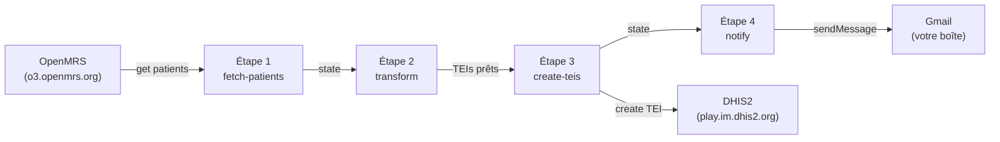

# OpenFn : guide de conception de workflows et d'écriture de jobs

Guide pratique pour construire un workflow OpenFn de bout en bout. Deux parties indépendantes : la partie A montre comment travailler en local avec le CLI ; la partie B montre comment faire les mêmes choses dans l'interface web de Lightning. Vous pouvez lire celle qui vous intéresse, ou les deux.

Le cas pratique récurrent : un workflow qui récupère des patients depuis OpenMRS, les transforme en TrackedEntities DHIS2, les charge dans DHIS2, puis envoie un email récapitulatif via Gmail.



Trois adaptateurs en jeu, deux types de credentials (basic auth pour OpenMRS et DHIS2, OAuth pour Gmail), et le pattern de curseur en annexe pour ceux qui veulent aller plus loin.

## Comment utiliser ce guide

Lisez de haut en bas. Repères dans le texte :

- ▶ **Étape à exécuter** : commande à lancer ou action à effectuer
- 💬 **Contexte** : ce qui se passe, à lire pendant qu'une commande tourne
- 🛟 **En cas de problème** : pannes typiques et solutions

## Table des matières

### Partie A : avec la ligne de commande (CLI)

1. [Concepts clés](#1-concepts-clés)
2. [Prérequis](#2-prérequis)
3. [Installer le CLI](#3-installer-le-cli)
4. [Préparer le projet](#4-préparer-le-projet)
5. [Étape 1 : récupérer des patients depuis OpenMRS](#5-étape-1--récupérer-des-patients-depuis-openmrs)
6. [Étape 2 : transformer les patients en TEIs DHIS2](#6-étape-2--transformer-les-patients-en-teis-dhis2)
7. [Étape 3 : créer les TEIs dans DHIS2](#7-étape-3--créer-les-teis-dans-dhis2)
8. [Étape 4 : envoyer un email via Gmail (OAuth)](#8-étape-4--envoyer-un-email-via-gmail-oauth)
9. [Enchaîner le tout : le workflow complet](#9-enchaîner-le-tout--le-workflow-complet)
10. [Débogage](#10-débogage)
11. [Bonnes pratiques](#11-bonnes-pratiques)
12. [Pattern curseur pour synchronisation incrémentale](#12-pattern-curseur-pour-synchronisation-incrémentale)
13. [Déployer sur Lightning](#13-déployer-sur-lightning)
14. [Exercices pratiques](#14-exercices-pratiques)

### Partie B : dans l'interface Lightning (UI)

15. [Vue d'ensemble de la plateforme](#15-vue-densemble-de-la-plateforme)
16. [Créer un projet](#16-créer-un-projet)
17. [La barre latérale d'un projet](#17-la-barre-latérale-dun-projet)
18. [La page Workflows et créer un nouveau workflow](#18-la-page-workflows-et-créer-un-nouveau-workflow)
19. [Le canevas du workflow](#19-le-canevas-du-workflow)
20. [Configurer un trigger](#20-configurer-un-trigger)
21. [Configurer un job (adaptateur, version, credential)](#21-configurer-un-job-adaptateur-version-credential)
22. [Créer une credential](#22-créer-une-credential)
23. [Écrire du code dans l'éditeur Monaco](#23-écrire-du-code-dans-léditeur-monaco)
24. [Lancer un workflow manuellement](#24-lancer-un-workflow-manuellement)
25. [Visualiser un run](#25-visualiser-un-run)
26. [La page History (Work Orders)](#26-la-page-history-work-orders)
27. [Les onglets de Project Settings](#27-les-onglets-de-project-settings)
28. [Channels](#28-channels)
29. [Sandboxes](#29-sandboxes)
30. [GitHub Sync depuis l'UI](#30-github-sync-depuis-lui)
31. [Cas pratique en mode UI](#31-cas-pratique-en-mode-ui)

### Référence

32. [Pour aller plus loin](#32-pour-aller-plus-loin)

# Partie A : avec la ligne de commande (CLI)

Vous écrivez vos jobs en local dans un éditeur de code, vous les testez avec le CLI, vous gardez tout dans un dépôt git. Bon pour le développement, le débogage et l'intégration continue.

## 1. Concepts clés

Cinq termes qu'on va utiliser sans arrêt.

**Project (projet)** : un dossier qui contient des workflows, des jobs et des credentials. Sur app.openfn.org un projet est un espace de travail logique. En local, c'est un dossier git avec un `workflow.json` et des fichiers `.js` à côté.

**Workflow** : une suite d'étapes (steps) qui s'exécutent dans un certain ordre, avec un déclencheur en début. Décrit dans un `workflow.json`.

**Step (étape)** ou **Job** : une boîte du workflow. Elle a un adaptateur, du code JavaScript, optionnellement une configuration (credentials). On utilise step et job de façon interchangeable.

**Adaptor (adaptateur)** : un module npm qui sait parler à un système externe. Naming convention : `@openfn/language-xyz`. Les trois qu'on utilise aujourd'hui :

- `@openfn/language-openmrs`
- `@openfn/language-dhis2`
- `@openfn/language-gmail`

**State (état)** : un objet JavaScript qui circule entre les steps. Au départ il contient au moins deux clés, `configuration` (les credentials) et `data` (l'entrée). Chaque step lit le state, fait ses opérations, retourne un nouveau state. Le state final d'un step devient le state initial du suivant.

💬 **Contexte :** `configuration` est écrasé entre deux steps par les credentials du step suivant. Donc ne stockez pas votre logique métier dans `configuration`. Tout ce que vous voulez transmettre d'un step à l'autre va ailleurs, par exemple `state.patients` ou `state.cursor`.

## 2. Prérequis

- **Node.js 18 ou plus récent**. Vérifiez avec `node -v`. Pour installer : <https://nodejs.org/>.
- **Git** installé (`git --version`).
- **Un éditeur de code**. VSCode recommandé, avec l'extension Prettier configurée comme formateur par défaut.
- **Un terminal**. macOS Terminal ou iTerm sur Mac, Windows Terminal sur Windows (toujours via WSL pour ce qui suit), n'importe quel terminal sur Linux.
- **Un compte Gmail** sur lequel vous allez générer un access_token plus tard. Votre Gmail personnel suffit.

## 3. Installer le CLI

▶ **Étape à exécuter :**

```sh
npm install -g @openfn/cli
```

Vérifiez :

```sh
openfn -v
openfn test
```

`openfn test` exécute un job de démonstration intégré. Si vous voyez `state.data = { name: 'Mamadou' }` ou équivalent dans la sortie, le CLI est correctement installé.

💬 **Contexte :** Le CLI s'occupe de tout pour vous. Il télécharge les adaptateurs à la volée la première fois que vous les utilisez (dans un dépôt local, dont vous pouvez voir le chemin avec `openfn repo list`). Vous n'avez pas besoin de faire `npm install` séparément pour chaque adaptateur.

Commandes que vous allez beaucoup utiliser aujourd'hui :

```sh
openfn jobs/1-fetch-patients.js -a openmrs   # exécuter un job seul
openfn workflow.json                         # exécuter le workflow complet
openfn docs openmrs                          # liste des fonctions de l'adaptateur openmrs
openfn docs openmrs get                      # documentation d'une fonction précise
openfn repo list                             # voir les adaptateurs installés localement
```

## 4. Préparer le projet

Ce dépôt contient déjà la structure :

```
madagascar-workflow-training/
├── workflow.json              # définition du workflow complet
├── jobs/                      # le code JavaScript de chaque step
│   ├── 1-fetch-patients.js
│   ├── 2-transform.js
│   ├── 3-create-teis.js
│   └── 4-notify.js
├── credentials/               # exemples de credentials (à copier et remplir)
│   ├── openmrs.json.example
│   ├── dhis2.json.example
│   └── gmail.json.example
├── tmp/                       # gitignored, pour les sorties intermédiaires
└── README.md                  # ce fichier
```

▶ **Étape à exécuter :** copiez les exemples de credentials en vrais fichiers (ils sont gitignored, donc pas de risque de fuite) :

```sh
cp credentials/openmrs.json.example credentials/openmrs.json
cp credentials/dhis2.json.example credentials/dhis2.json
cp credentials/gmail.json.example credentials/gmail.json
```

On les remplira au fur et à mesure des étapes suivantes.

## 5. Étape 1 : récupérer des patients depuis OpenMRS

Ouvrez `jobs/1-fetch-patients.js` :

```js
get('patient', { q: 'John', limit: 5 });

fn(state => {
  const patients = state.data?.results ?? state.data ?? [];
  console.log(`OpenMRS a renvoyé ${patients.length} patient(s).`);
  return { ...state, patients };
});
```

💬 **Contexte :**

- `get('patient', { q: 'John', limit: 5 })` est une opération de l'adaptateur OpenMRS. Le premier argument est le path de la ressource (relatif à `/ws/rest/v1/`), le second est un objet d'options. Ici on cherche les 5 premiers patients dont le nom contient "John".
- `fn(state => { ... })` est une opération de transformation pure. Elle reçoit le state, peut faire ce qu'elle veut, doit retourner le nouveau state. Ici on copie les patients depuis `state.data` vers `state.patients` pour qu'ils survivent au step suivant (où `state.data` sera écrasé par le mapping).
- Les deux opérations sont au **niveau supérieur** du fichier. Elles s'exécutent en série, le state passe de l'une à l'autre. **Ne jamais imbriquer une opération dans le callback d'une autre.**

Le credential OpenMRS pointe sur l'instance de démo OpenMRS 3. Vérifiez `credentials/openmrs.json` :

```json
{
  "instanceUrl": "https://o3.openmrs.org/openmrs",
  "username": "admin",
  "password": "Admin123"
}
```

⚠️ Notez deux choses :

1. `instanceUrl` se termine par `/openmrs`. C'est le chemin de contexte de l'application sur le serveur Tomcat. Sans ce suffixe, vous obtenez une 404 (l'adaptateur construit l'URL comme `{instanceUrl}/ws/rest/v1/...`).
2. La documentation officielle d'OpenMRS cite `dev3.openmrs.org`. Les deux pointent vers le même backend OpenMRS 3. Si `dev3` répond avec une erreur CloudFront (403), passez à `o3.openmrs.org/openmrs` (ce qu'on utilise ici).

### Où trouver l'UUID d'un patient et la structure des données

- **L'UUID du patient** est visible dans l'URL quand vous ouvrez son dossier dans OpenMRS 3 (`https://o3.openmrs.org/openmrs/spa/patient/<UUID>/chart/`). C'est aussi le champ `uuid` de chaque résultat JSON renvoyé par `/ws/rest/v1/patient?q=...`.
- **La structure complète d'un patient** est documentée sur <https://rest.openmrs.org/#patient>. Vous pouvez aussi simplement curl l'API : `curl -u admin:Admin123 'https://o3.openmrs.org/openmrs/ws/rest/v1/patient/<UUID>?v=full'` et lire la réponse.
- **`v=full`** est le paramètre qui change tout. Sans, OpenMRS renvoie juste `{ uuid, display, links }`. Avec, vous obtenez `person.names`, `identifiers`, `addresses`, etc. Voir <https://rest.openmrs.org/#representations> pour les autres représentations (`default`, `full`, `custom:(...)`).

▶ **Étape à exécuter :** créer le state initial avec la configuration OpenMRS, puis lancer le job.

```sh
mkdir -p tmp
cat > tmp/initial-state.json <<'JSON'
{
  "configuration": {
    "instanceUrl": "https://o3.openmrs.org/openmrs",
    "username": "admin",
    "password": "Admin123"
  }
}
JSON

openfn jobs/1-fetch-patients.js \
  -a @openfn/language-openmrs \
  -s tmp/initial-state.json \
  -o tmp/state-after-fetch.json \
  --log info
```

Vous devriez voir `OpenMRS a renvoyé N patient(s).` (N varie selon les données actuelles de l'instance) et trouver dans `tmp/state-after-fetch.json` la clé `patients` avec les objets patient au format complet.

🛟 **En cas de problème :**

- **`Error: connect ETIMEDOUT`** : pas de réseau ou l'instance est en maintenance. Réessayez ou basculez sur `https://dev3.openmrs.org/openmrs` qui pointe vers le même backend.
- **`403 Forbidden` avec un body CloudFront** : c'est un blocage CloudFront côté `dev3.openmrs.org` qui se déclenche de manière imprévisible. Utilisez `https://o3.openmrs.org/openmrs` à la place.
- **`401 Unauthorized`** : vérifiez les credentials. Le mot de passe `Admin123` est sensible à la casse.
- **`patients` vide** : changez `q: 'John'` pour `q: ''` (sans filtre, retourne tous les patients), ou cherchez un autre prénom présent dans les données actuelles. La base de démo est régulièrement réinitialisée.

## 6. Étape 2 : transformer les patients en TEIs DHIS2

Ouvrez `jobs/2-transform.js` :

```js
const ORG_UNIT = 'ImspTQPwCqd';
const TRACKED_ENTITY_TYPE = 'nEenWmSyUEp';
const FIRST_NAME_ATTR = 'w75KJ2mc4zz';
const LAST_NAME_ATTR = 'zDhUuAYrxNC';

fn(state => {
  const teis = state.patients.map(patient => {
    const names = patient.person?.names?.[0] ?? {};
    return {
      orgUnit: ORG_UNIT,
      trackedEntityType: TRACKED_ENTITY_TYPE,
      attributes: [
        { attribute: FIRST_NAME_ATTR, value: names.givenName ?? 'Inconnu' },
        { attribute: LAST_NAME_ATTR, value: names.familyName ?? 'Inconnu' },
      ],
    };
  });

  console.log(`${teis.length} TrackedEntities prêts pour DHIS2.`);
  return { ...state, teis };
});
```

💬 **Contexte :**

- Pas d'appel réseau ici. Juste du JavaScript pur dans un `fn()`.
- Les UIDs (`ImspTQPwCqd`, `nEenWmSyUEp`, `w75KJ2mc4zz`, `zDhUuAYrxNC`) viennent du dataset de démo standard de play.dhis2.org. Ils sont stables entre versions sur l'instance play. Si vous pointez vers une autre instance DHIS2, vous devrez les adapter.
- Le mapping est volontairement simple. Dans la vraie vie vous ajouteriez un identifiant unique pour la déduplication (voir [exercices](#exercices-pratiques)), la date de naissance, le genre, etc.

### Où trouver ces UIDs sur l'instance play DHIS2

Tous ces IDs sont visibles dans le dashboard de l'instance ou via l'API.

**L'orgUnit racine "Sierra Leone" (`ImspTQPwCqd`) :**

- Dans l'UI : ouvrez **Maintenance → Organisation Unit**, cherchez "Sierra Leone", l'ID est dans la colonne ID ou dans l'URL une fois ouvert (`/maintenance/.../id=ImspTQPwCqd`).
- Via l'API : `curl -u admin:district 'https://play.im.dhis2.org/stable-2-43-0/api/organisationUnits?fields=id,name&filter=name:eq:Sierra Leone'`.

**Le trackedEntityType "Person" (`nEenWmSyUEp`) :**

- UI : **Maintenance → Tracked entity types → Person**, l'ID est en haut à droite ou dans l'URL.
- API : `curl -u admin:district 'https://play.im.dhis2.org/stable-2-43-0/api/trackedEntityTypes?fields=id,name'`.

**Les attributs "First name" et "Last name" (`w75KJ2mc4zz`, `zDhUuAYrxNC`) :**

- UI : **Maintenance → Tracked entity attribute**, cherchez "First name" puis "Last name", l'ID est visible une fois ouvert.
- API : `curl -u admin:district 'https://play.im.dhis2.org/stable-2-43-0/api/trackedEntityAttributes?fields=id,name&filter=name:in:[First name,Last name]'`.

Astuce : pour explorer les attributs requis ou optionnels d'un type, faites `curl -u admin:district 'https://play.im.dhis2.org/stable-2-43-0/api/trackedEntityTypes/nEenWmSyUEp?fields=trackedEntityTypeAttributes[mandatory,trackedEntityAttribute[id,name]]'`. Sur le TET Person, aucun attribut n'est marqué `mandatory`, donc First name + Last name suffisent pour créer un TEI valide.

Le step ne touche pas à DHIS2 et ne nécessite donc pas de credentials. Vous pouvez le tester à sec avec le state de l'étape précédente :

```sh
openfn jobs/2-transform.js \
  -a @openfn/language-common \
  -s tmp/state-after-fetch.json \
  -o tmp/state-after-transform.json
```

Vous devriez voir `5 TrackedEntities prêts pour DHIS2.` et trouver dans `tmp/state-after-transform.json` une clé `teis` avec 5 objets prêts à être postés à DHIS2.

## 7. Étape 3 : créer les TEIs dans DHIS2

Ouvrez `jobs/3-create-teis.js` :

```js
each(
  '$.teis[*]',
  create('trackedEntities', state => state.data)
);

fn(state => {
  const attempted = state.teis?.length ?? 0;
  console.log(`${attempted} TrackedEntities envoyés à DHIS2.`);
  return { ...state, createdCount: attempted };
});
```

💬 **Contexte :**

- `each(path, operation)` itère sur un tableau dans le state et exécute `operation` à chaque élément. À chaque itération, l'élément courant est dans `state.data`.
- `'$.teis[*]'` est un chemin JSONPath qui sélectionne tous les éléments du tableau `teis`.
- `create('trackedEntities', state => state.data)` poste un nouveau TrackedEntity à DHIS2 pour chaque itération. On lit la valeur via la lambda `state => state.data` pour récupérer l'élément courant.
- Le count se prend dans `state.teis.length`, pas dans `state.references.length`. `references` accumule tous les `state.data` précédents (initial state, résultat de l'étape 1, etc.), pas seulement les TEIs créés par cette étape.

▶ **Étape à exécuter :** configurez le credential DHIS2 dans `credentials/dhis2.json`. L'instance play.dhis2.org est publique :

```json
{
  "hostUrl": "https://play.im.dhis2.org/stable-2-43-0",
  "username": "admin",
  "password": "district"
}
```

L'URL change entre versions sur play.dhis2.org (chaque version stable a sa propre URL `stable-X-Y-Z`). Si `stable-2-43-0` ne répond plus, allez sur <https://play.im.dhis2.org/> et copiez l'URL de la version stable courante.

Maintenant lancez le step. Notez qu'on charge le state de fin de l'étape 2 et qu'on injecte les credentials DHIS2 (la `configuration` du state initial est écrasée à chaque step par les credentials du step) :

```sh
jq -s '.[0] * { "configuration": .[1] }' \
  tmp/state-after-transform.json \
  credentials/dhis2.json \
  > tmp/state-before-dhis2.json

openfn jobs/3-create-teis.js \
  -a @openfn/language-dhis2 \
  -s tmp/state-before-dhis2.json \
  -o tmp/state-after-dhis2.json \
  --log info
```

Vous devriez voir `DHIS2 a confirmé la création de 5 TrackedEntities.` et chaque appel HTTP dans les logs.

💬 **Contexte sur `jq` :** on combine le state précédent et le credential dans un seul fichier d'entrée. C'est le rôle que Lightning joue automatiquement entre deux steps. En local, on le fait à la main pour tester un step isolé. Quand on lance le workflow complet (section 9), ce branchement se fait tout seul.

🛟 **En cas de problème :**

- **`E7003 / Object referenced does not exist`** : un UID utilisé dans `2-transform.js` n'existe pas sur l'instance DHIS2 que vous avez choisie. Vérifiez avec `openfn docs dhis2 get` puis un appel `get('trackedEntityTypes')` pour lister les UIDs réels.
- **`E1083 / OrganisationUnit cannot be empty`** : `state.data.orgUnit` est vide. Inspectez `tmp/state-after-transform.json`.

## 8. Étape 4 : envoyer un email via Gmail (OAuth)

C'est l'étape qui exerce un type de credential différent : OAuth 2.0. L'adaptateur Gmail attend un `access_token` dans la configuration. Pour le générer en local, on passe par Google OAuth Playground.

### 8.1 Générer un access_token avec OAuth Playground

1. Allez sur <https://developers.google.com/oauthplayground/>.
2. Cliquez sur l'icône engrenage en haut à droite, cochez **Use your own OAuth credentials**. Si vous n'avez pas de client OAuth Google, sautez cette étape, l'outil utilise un client de démonstration avec des limites.
3. Dans la liste des scopes à gauche, cherchez **Gmail API v1** et sélectionnez `https://www.googleapis.com/auth/gmail.send`.
4. Cliquez **Authorize APIs**. Connectez-vous avec votre Gmail et autorisez l'accès.
5. Cliquez **Exchange authorization code for tokens**.
6. Copiez la valeur du champ **Access token**.

⚠️ Le token expire au bout d'une heure. Si vous attendez trop entre la génération et le test, il faudra le régénérer.

### 8.2 Configurer le credential Gmail

Éditez `credentials/gmail.json` :

```json
{
  "access_token": "COLLER_VOTRE_ACCESS_TOKEN_ICI",
  "recipient": "votre.adresse@exemple.org"
}
```

`recipient` n'est pas une clé standard de l'adaptateur Gmail. On l'ajoute pour que le job sache à qui envoyer. On y accède dans le job via `state.configuration.recipient`.

### 8.3 Le code du step

Ouvrez `jobs/4-notify.js` :

```js
fn(state => {
  const count = state.createdCount ?? 0;
  const subject = `[OpenFn] Synchro OpenMRS → DHIS2 terminée`;
  const body =
    `Synchronisation patients OpenMRS → DHIS2 terminée à ${new Date().toISOString()}.\n` +
    `Patients récupérés : ${state.patients?.length ?? 0}.\n` +
    `TrackedEntities créés dans DHIS2 : ${count}.`;

  return { ...state, notification: { subject, body } };
});

sendMessage(state => ({
  to: state.configuration.recipient,
  subject: state.notification.subject,
  body: state.notification.body,
}));
```

▶ **Étape à exécuter :**

```sh
jq -s '.[0] * { "configuration": .[1] }' \
  tmp/state-after-dhis2.json \
  credentials/gmail.json \
  > tmp/state-before-gmail.json

openfn jobs/4-notify.js \
  -a @openfn/language-gmail \
  -s tmp/state-before-gmail.json \
  -o tmp/state-final.json \
  --log info
```

Vous devriez recevoir un email en quelques secondes dans la boîte indiquée dans `recipient`.

🛟 **En cas de problème :**

- **`401 Unauthorized` ou `Invalid Credentials`** : le token a expiré. Régénérez-le sur OAuth Playground.
- **`403 insufficientPermissions`** : le scope demandé sur OAuth Playground n'incluait pas `gmail.send`. Recommencez en cochant le bon scope.

## 9. Enchaîner le tout : le workflow complet

Maintenant que chaque step marche en isolation, on les enchaîne. C'est le rôle de `workflow.json` :

```json
{
  "options": {
    "start": "fetch-patients"
  },
  "workflow": {
    "name": "openmrs-to-dhis2-sync",
    "steps": [
      {
        "id": "fetch-patients",
        "name": "fetch-patients",
        "expression": "./jobs/1-fetch-patients.js",
        "adaptor": "@openfn/language-openmrs",
        "configuration": "./credentials/openmrs.json",
        "next": { "transform": true }
      },
      {
        "id": "transform",
        "name": "transform",
        "expression": "./jobs/2-transform.js",
        "adaptor": "@openfn/language-common",
        "next": { "create-teis": true }
      },
      {
        "id": "create-teis",
        "name": "create-teis",
        "expression": "./jobs/3-create-teis.js",
        "adaptor": "@openfn/language-dhis2",
        "configuration": "./credentials/dhis2.json",
        "next": { "notify": true }
      },
      {
        "id": "notify",
        "name": "notify",
        "expression": "./jobs/4-notify.js",
        "adaptor": "@openfn/language-gmail",
        "configuration": "./credentials/gmail.json"
      }
    ]
  }
}
```

💬 **Contexte :**

- Chaque step a un `id` (référence canonique, utilisée par `options.start` et `next`), un `name` (utilisé seulement pour les logs), un `expression` (chemin vers le code), un `adaptor`, et optionnellement une `configuration` (chemin vers le credential).
- `id` et `name` peuvent être identiques pour la lisibilité. Sur Lightning, l'`id` est typiquement un UUID généré automatiquement.
- `next` définit le step suivant en référant son `id`. Une valeur `true` signifie "toujours". On peut aussi mettre un objet `{ "condition": "..." }` avec une expression JavaScript stricte pour brancher conditionnellement (par exemple `"!state.error"`).
- Le step `notify` n'a pas de `next` : c'est le dernier.
- `options.start` indique par où commencer. Pratique pour rejouer une partie du workflow.

▶ **Étape à exécuter :**

```sh
openfn workflow.json --log info
```

Le CLI enchaîne les quatre étapes, fait passer le state de l'une à l'autre, charge la configuration appropriée à chaque step. Vous voyez les quatre `console.log` apparaître dans l'ordre, et finalement l'email arrive.

💬 **Contexte sur le passage de state :**

- À la fin de chaque step, le `state` retourné devient le `state` initial du step suivant.
- Sauf que `configuration` est écrasé par les credentials du step suivant. C'est pour ça qu'on a copié `state.patients`, `state.teis`, `state.createdCount` dans des clés à nous, pas dans `state.data`.
- Vous pouvez voir l'état intermédiaire de chaque step avec `--cache-steps` :

```sh
openfn workflow.json --cache-steps --log info
```

Les sorties par step sont dans `.cli-cache/openmrs-to-dhis2-sync/<step-name>.json`.

## 10. Débogage

### Lire les logs

Le niveau de log par défaut est correct pour un usage normal. Pour voir tous les appels réseau, les options résolues, le détail des opérations :

```sh
openfn workflow.json --log debug
```

### Inspecter le state à mi-parcours

```js
firstOperation(...);
fn(state => { console.log(JSON.stringify(state, null, 2)); return state; });
secondOperation(...);
```

⚠️ `console.log(state)` affiche aussi `state.configuration`, qui contient vos credentials. Retirez ces logs avant de pousser quoi que ce soit en production.

### Repartir d'un step en particulier

```sh
openfn workflow.json --start create-teis --cache-steps
```

Pratique quand vous déboguez le step 3 et que vous ne voulez pas refaire le step 1 (qui fait un appel réseau OpenMRS) à chaque essai.

### Ignorer une sortie partielle

Par défaut, le CLI refuse d'écrire un output state qui ne sérialise pas en JSON (objets circulaires, fonctions, etc.). Pour autoriser :

```sh
openfn jobs/1-fetch-patients.js -a openmrs --no-strict-output
```

## 11. Bonnes pratiques

- **camelCase** pour les noms de variables et constantes (`firstName`, pas `first_name`).
- **Un commentaire sur une seule ligne** avant chaque opération, qui explique pourquoi, pas quoi.
- **Toujours retourner `state`** depuis un `fn()`, sauf raison expresse de retourner autre chose.
- **Toujours formater avec un linter** (Prettier dans VSCode est le défaut OpenFn) avant de pousser. Le code formaté est lisible et évite les diff bruyants en code review.
- **Retirer les `console.log` de debug** avant de pousser en production.
- **Ne jamais écrire de valeurs sensibles en dur dans le code**. Toujours via `state.configuration.password`, jamais `"MotDePasse123"`. Lightning efface les valeurs de `configuration` dans les logs ; le CLI plus ancien ne le fait pas, donc autant ne jamais les y mettre.
- **Ne jamais utiliser `each()` sur `state.data` pour faire un fetch ensuite**. À chaque itération, `state.data` est écrasé par l'élément courant. Si vous voulez faire un appel par élément, utilisez un callback qui ne touche pas à `state.data`.

## 12. Pattern curseur pour synchronisation incrémentale

Notre workflow récupère "les 5 premiers patients qui contiennent John dans leur nom" à chaque exécution. En production vous voulez récupérer uniquement les patients **nouveaux ou modifiés depuis le dernier run**. C'est le rôle d'un curseur.

Deux techniques :

### Curseur basé sur le temps

```js
// Au début du job : lit state.cursor s'il existe, sinon part de 1970.
cursor($.cursor, { defaultValue: '1970-01-01' });

get('patient', state => ({
  q: '',
  lastChanged: state.cursor,
  limit: 100,
}));

fn(state => {
  // Après traitement réussi, on fait avancer le curseur jusqu'à maintenant.
  return { ...state, cursor: new Date().toISOString() };
});
```

L'opération `cursor()` résout la valeur, la parse comme date si c'est une chaîne, et la place dans `state.cursor`. Sur Lightning, la nouvelle valeur de `state.cursor` à la fin du run est persistée automatiquement et réinjectée au run suivant. En CLI, vous gérez la persistance vous-même via le fichier d'output state.

### Curseur de pagination

```js
cursor($.cursor, { defaultValue: 1 });

get('patient', state => ({
  q: '',
  page: state.cursor,
  limit: 100,
}));

fn(state => {
  const hasMore = state.data?.length === 100;
  return { ...state, cursor: hasMore ? state.cursor + 1 : 1 };
});
```

💬 **Contexte :** un curseur est un signet qui dit au job où reprendre la prochaine fois. Ne mettez à jour le curseur qu'après que le run a réussi. Si le job échoue à mi-parcours, le curseur ne doit pas avancer, sinon vous perdez des données.

## 13. Déployer sur Lightning

Quand vos jobs marchent en local et que vous voulez les pousser sur une instance Lightning, vous avez deux options.

### Via l'interface Lightning

Copier-coller le code de chaque job dans l'éditeur web de Lightning. Marche pour des workflows simples, devient pénible au-delà de 3 ou 4 steps.

### Via `openfn deploy` et un fichier `project.yaml`

```sh
openfn deploy -p project.yaml --apiUrl https://votre-instance-lightning
```

Le fichier `project.yaml` décrit la structure complète d'un projet Lightning (workflows, jobs, credentials, déclencheurs). Le template officiel est sur <https://github.com/OpenFn/project>.

Cette approche s'intègre bien à GitHub Sync : Lightning peut écouter un dépôt et appliquer automatiquement les changements de `project.yaml`.

## 14. Exercices pratiques

Trois exercices, du plus simple au plus avancé. Ils prolongent le workflow qu'on vient de construire, en utilisant les mêmes instances OpenMRS et DHIS2.

### Exercice 1 (facile) : ne synchroniser que les patients adultes

Dans `jobs/2-transform.js`, ajoutez un filtre avant le `.map(...)`. La structure de chaque patient OpenMRS contient `patient.person.age` (entier).

Indice :

```js
const teis = state.patients
  .filter(patient => patient.person?.age >= 18)
  .map(patient => { ... });
```

Vérification : relancez le workflow, comparez le nombre de patients fetchés (log de l'étape 1) au nombre de TEIs envoyés (log de l'étape 3). Le second doit être inférieur ou égal au premier.

### Exercice 2 (moyen) : inclure l'UUID OpenMRS dans le TEI

Pour pouvoir déduper plus tard, vous voulez associer chaque TEI DHIS2 à son patient OpenMRS via un identifiant unique. La play instance a un attribut "Person Unique ID" déjà prévu pour ça : `lZGmxYbs97q`.

Modifiez le mapping de `jobs/2-transform.js` pour ajouter une troisième entrée dans `attributes` :

```js
{ attribute: 'lZGmxYbs97q', value: patient.uuid }
```

Vérification : après le workflow, ouvrez DHIS2 → Tracker Capture → cherchez un patient → vérifiez que "Person Unique ID" contient bien l'UUID OpenMRS.

### Exercice 3 (avancé) : implémenter un curseur basé sur le temps

Aujourd'hui le workflow récupère les 5 premiers patients dont le nom contient "John" à chaque exécution. C'est pratique pour démontrer, mais en production vous voulez ne récupérer que les patients **nouveaux ou modifiés depuis le dernier run**.

OpenMRS REST accepte les paramètres `lastUpdated` et `dateModified`. Utilisez le pattern curseur (voir §12) pour :

1. Au début du job 1, appeler `cursor($.cursor, { defaultValue: '1970-01-01' })`.
2. Passer `lastUpdated: state.cursor` dans les options de `get('patient', ...)`.
3. À la fin du job 4, retourner `{ ...state, cursor: new Date().toISOString() }` pour faire avancer le curseur.

Tests :

- Premier run : récupère tout l'historique (depuis 1970).
- Deuxième run immédiatement après : ne récupère rien (rien n'a changé entre les deux runs).
- Créez ou modifiez un patient dans OpenMRS, relancez : doit récupérer uniquement ce patient.

Astuce : en CLI, le curseur n'est pas persisté automatiquement. Vous devrez sauvegarder `state.cursor` à la fin et le réinjecter au prochain run via `-s`. Sur Lightning, c'est automatique.

# Partie B : dans l'interface Lightning (UI)

Mêmes objets (projets, workflows, jobs, credentials, runs), construits dans le navigateur. Pas de Git, pas de fichier sur disque, mais l'édition collaborative en temps réel et un canevas visuel pour le DAG du workflow.

L'interface décrite ici est celle de Lightning à partir de la version où le canevas collaboratif (basé sur React et Yjs) a remplacé l'ancien canevas LiveView. Si vous voyez encore l'ancien, c'est probablement parce qu'une option de la base de feature flags désactive le nouveau ; demandez à votre admin.

## 15. Vue d'ensemble de la plateforme

Lightning tourne sur plusieurs serveurs dans l'écosystème OpenFn :

- **app.openfn.org** : l'instance hébergée par l'équipe OpenFn, gratuite pour les comptes individuels, payante pour les organisations.
- **openfn.msppas.ne** : le serveur Niger en production (accessible uniquement aux comptes autorisés).
- **Votre instance locale** : Lightning lancé sur votre laptop ou votre VPS, par exemple via le déploiement vu dans l'autre formation.

L'interface est la même partout. Connectez-vous, vous arrivez sur la liste de vos projets (`/projects`).

La barre latérale de gauche, quand vous êtes au niveau utilisateur (pas encore dans un projet), affiche :

- **Projects** : la liste de vos projets.
- **User Profile** : vos paramètres, votre 2FA, votre photo.
- **Credentials** : les credentials que vous possédez. Une credential appartient à un utilisateur et peut être partagée avec un ou plusieurs projets.
- **API Tokens** : vos tokens d'API personnels pour appeler l'API Lightning depuis l'extérieur.

Les superutilisateurs voient aussi une entrée **Admin Menu** plus haut, qui ouvre la gestion système (utilisateurs, projets, audit log, authentication).

## 16. Créer un projet

Seuls les superutilisateurs créent des projets de premier niveau. Si vous n'en êtes pas un, sautez à la section 17, votre admin vous a déjà mis dans un projet.

▶ **Étape à exécuter :** depuis l'Admin Menu, cliquez sur **Projects**, puis sur le bouton **New Project** en haut à droite.

Le formulaire vous demande :

- **Project name** (obligatoire) : un identifiant, en kebab-case (par exemple `madagascar-pilot-2026`).
- **Description** (optionnel).
- **Members** : les utilisateurs à ajouter d'office, avec leur rôle.
- **Retention periods** : combien de temps Lightning conserve les dataclips, les runs, l'historique.

Cliquez sur **Save**. Le projet apparaît dans la liste.

💬 **Contexte :** un projet est l'unité d'organisation principale. Tous les workflows, credentials, channels et collections appartiennent à un projet. Les membres d'un projet sont indépendants des membres d'un autre.

## 17. La barre latérale d'un projet

Cliquez sur un projet depuis la liste pour l'ouvrir. La barre latérale change pour afficher les sections du projet :

- **Workflows** : la liste des workflows et le canevas.
- **Channels** : les points d'entrée du projet, principalement les webhooks et leurs méthodes d'authentification.
- **Sandboxes** : les sous-projets cloisonnés (voir section 29).
- **History** : l'historique des exécutions (work orders et runs).
- **Settings** : tous les paramètres du projet, organisés en onglets (voir section 27).

Le breadcrumb en haut de l'écran montre toujours : nom du projet → la section courante → l'objet courant.

## 18. La page Workflows et créer un nouveau workflow

La page Workflows liste tous les workflows du projet, avec leur état (enabled/disabled), leur dernier run, et un mini graphique d'activité.

En haut à droite :

- Un champ de recherche **Search** pour filtrer par nom.
- Un bouton **Create new workflow** qui ouvre la fenêtre de création.

La fenêtre de création propose trois méthodes :

- **Template** (par défaut) : partir d'un template prêt à l'emploi ou d'un workflow vide.
- **Import** : importer un YAML de workflow existant.
- **Build with AI ✨** : décrire le workflow voulu en langage naturel à l'assistant AI, qui le construit pour vous.

Choisissez **Template** → un workflow vide, cliquez sur **Create**. Vous atterrissez sur le canevas du nouveau workflow.

## 19. Le canevas du workflow

Le canevas est l'endroit où vous voyez et modifiez visuellement le DAG (graphe orienté acyclique) du workflow. C'est un éditeur collaboratif basé sur Yjs : plusieurs personnes peuvent éditer en même temps et chacun voit les curseurs des autres en temps réel.

### Le header

En haut du canevas :

- **Le breadcrumb** : nom du projet → Workflows → nom du workflow.
- **Une pastille de version** à côté du nom du workflow. Elle indique `latest` si vous voyez la dernière version, sinon la date du snapshot.
- **Un tag d'environnement** (si le projet a une valeur dans `project.env`, par exemple `production`).
- **Les utilisateurs en ligne** : avatars de qui d'autre regarde ou édite le workflow.

À droite :

- Un **toggle** pour activer/désactiver le workflow (`Enabled` / `Disabled`).
- Un bouton **Save** (raccourci `Cmd+S` ou `Ctrl+S`). Si GitHub Sync est configuré, c'est un bouton scindé avec une option **Save & Sync**.
- Un bouton **Run** (lance un work order manuel, voir section 24).
- Un bouton **AI Assistant** pour discuter du workflow avec l'IA.

### La zone du canevas

C'est l'espace central où apparaissent les nœuds (jobs et triggers) et les arêtes (paths) qui les connectent.

- Faites glisser pour déplacer un nœud.
- Cliquez sur un nœud ou une arête pour le sélectionner et ouvrir son inspector à droite (voir section 20 et 21).
- Cliquez ailleurs sur le canevas pour désélectionner.

Sur un workflow vide, vous voyez deux blocs initiaux : un trigger placeholder et un job placeholder, connectés.

## 20. Configurer un trigger

Cliquez sur le nœud trigger. Un panneau s'ouvre à droite avec ses champs.

### Trigger Type

Choisissez parmi :

- **Webhook** : l'option par défaut. Lightning expose une URL HTTP, n'importe quel système qui POST sur cette URL déclenche le workflow.
- **Cron** : déclenche le workflow à intervalle régulier selon une expression cron.
- **Kafka** : Lightning consomme un topic Kafka. Disponible seulement si l'instance a Kafka activé.

### Pour un trigger Webhook

Le panneau affiche :

- **Webhook URL** : l'URL générée par Lightning, à copier et à donner au système qui doit déclencher le workflow.
- **Webhook Authentication** : sécurisation optionnelle. Par défaut le webhook est ouvert. Vous pouvez ajouter une authentification Basic ou un API Key en cliquant sur le bouton qui ouvre **WebhookAuthMethodModal**.

### Pour un trigger Cron

Le panneau affiche :

- **Cron Expression** : un constructeur visuel (sélecteurs minutes/heures/jours) qui produit l'expression cron correspondante. Vous pouvez aussi taper directement la chaîne cron si vous la connaissez.
- **Cron Input Source** : la donnée initiale qui démarre le run. Soit un état vide, soit le dataclip du dernier run réussi.

### Pour un trigger Kafka

Le panneau affiche :

- **Kafka Hosts** : la liste des brokers Kafka, séparés par des virgules (par exemple `localhost:9092, broker2:9092`).
- **Topics** : les topics à consommer (`topic1, topic2, topic3`).
- Plus quelques options d'authentification et de partition.

## 21. Configurer un job (adaptateur, version, credential)

Cliquez sur un nœud job. Le panneau d'inspection s'ouvre à droite avec :

- **Job Name** : un nom court pour le step. Apparaît dans les logs et l'historique.
- **Adaptor** : la carte d'adaptateur, avec un bouton pour la changer ou la configurer.
- **Credential** : la credential utilisée par ce step.

Cliquez sur la carte de l'adaptateur (ou sur **Configure** si le job n'en a pas encore). La fenêtre **Configure connection** s'ouvre.

### La fenêtre Configure connection

Trois sections :

1. **Adaptor** : montre l'adaptateur courant, avec un bouton **Change** qui ouvre la liste de tous les adaptateurs disponibles.
2. **Version** : un sélecteur de version pour cet adaptateur. Par défaut `latest`. Vous pouvez épingler une version précise pour la reproductibilité.
3. **Credential** : la liste des credentials disponibles pour cet adaptateur, en trois groupes :
   - Les credentials **dont le schéma correspond à cet adaptateur** (par exemple les credentials OpenMRS pour un job OpenMRS).
   - Les credentials **génériques** (HTTP brut, Raw).
   - Les credentials **keychain** (credentials qui résolvent dynamiquement vers une vraie credential).

   À droite de chaque ligne, un bouton **Edit** (si vous êtes propriétaire) ou un avatar de propriétaire.

   En haut à droite de la section credential, un lien **New Credential** qui ouvre le formulaire de création (voir section 22).

   Si aucune credential ne correspond, vous voyez un message **No credentials found in this project** avec un lien **Create a new credential**.

   Quand des credentials non-correspondantes existent, un toggle **Other credentials** permet de les voir aussi.

Cliquez sur **Close** pour appliquer les changements (ils sont synchronisés en direct dans le Y.Doc collaboratif, donc même les autres éditeurs voient le changement immédiatement).

### La sélection d'adaptateur

La fenêtre **AdaptorSelectionModal** affiche :

- Un champ de recherche : **Search for an adaptor to connect...**.
- Deux groupes : **Adaptors in this project** (les adaptateurs déjà utilisés dans le projet courant) et **All adaptors** (le reste).
- Si aucun adaptateur ne correspond, un encart bleu propose le HTTP adaptor comme repli pour appeler n'importe quelle REST API.

Cliquez sur une ligne pour sélectionner l'adaptateur ; la fenêtre se ferme et vous revenez sur la fenêtre Configure connection avec l'adaptateur changé.

## 22. Créer une credential

Une credential porte les identifiants d'authentification d'un système distant. Il y a deux façons de la créer.

### Depuis l'inspector d'un job (inline)

Dans la fenêtre **Configure connection**, cliquez sur **New Credential** (en haut à droite de la section credential). Un formulaire s'ouvre, pré-rempli avec le type qui correspond à l'adaptateur courant (par exemple le schéma OpenMRS pour un job OpenMRS).

Remplissez le formulaire (les champs varient selon l'adaptateur : URL, username, password, ou token OAuth, etc.) et cliquez **Save**. La nouvelle credential est créée, automatiquement attachée au projet courant, et sélectionnée pour ce job.

### Depuis Project Settings → Credentials

▶ Allez dans **Settings** (barre latérale du projet) → onglet **Credentials**.

Vous voyez la liste des credentials qui appartiennent au projet (mises là par leurs propriétaires).

Cliquez sur **Create a new credential** ou **Create a new keychain credential**. Choisissez le type d'adaptateur dans le menu, remplissez le formulaire, **Save**.

### Depuis votre profil (user-level)

Une credential peut aussi appartenir directement à un utilisateur, sans projet. Allez dans la barre latérale **Credentials** (niveau utilisateur). Créez-en une, puis attachez-la à un ou plusieurs projets via le sélecteur de projets en bas du formulaire.

C'est utile quand vous voulez réutiliser la même credential dans plusieurs projets : un seul mot de passe à changer le jour où il expire.

### Types de credentials

- **Schéma spécifique** : un formulaire généré à partir du schéma JSON de l'adaptateur. Garantit que tous les champs requis sont présents.
- **Raw** : un objet JSON libre. À utiliser quand un adaptateur n'a pas de schéma ou quand vous voulez stocker une structure non standard.
- **OAuth** : Lightning gère le flow OAuth pour vous (au moins pour les fournisseurs intégrés comme Google, Salesforce, etc.). Vous cliquez sur **Authorize**, Lightning vous redirige chez le fournisseur, vous autorisez, vous revenez, le token est stocké et rafraîchi automatiquement.
- **Keychain** : une credential qui résout dynamiquement vers une autre credential au moment du run, en fonction d'une expression. Utile pour les déploiements multi-environnements.

Toutes les credentials sont chiffrées au repos avec la clé `PRIMARY_ENCRYPTION_KEY` de l'instance.

## 23. Écrire du code dans l'éditeur Monaco

Sélectionnez un job sur le canevas. Sous le panneau d'inspection à droite, l'éditeur de code Monaco apparaît. C'est le même éditeur que VSCode, avec autocomplétion, signature des fonctions de l'adaptateur, et coloration syntaxique JavaScript.

Pour passer l'éditeur en plein écran, cliquez sur l'icône **Open IDE** en haut à droite de l'éditeur, ou utilisez le bouton de bascule au-dessus du panneau.

En mode IDE plein écran, le layout devient :

- À gauche : l'arborescence des steps du workflow (`Steps`).
- Au centre : l'éditeur Monaco avec le code du step sélectionné.
- À droite (après un run) : trois onglets pour visualiser le résultat : **Logs**, **Input**, **Output** (voir section 25).

L'autocomplétion charge automatiquement les types de l'adaptateur courant. Tapez `g` dans un job avec l'adaptateur OpenMRS et vous voyez `get`, `getReferenceData`, etc. avec leur signature.

L'éditeur est collaboratif : si une autre personne édite le même job en même temps, vous voyez son curseur et ses changements en temps réel.

`Cmd+S` ou `Ctrl+S` sauvegarde tout le workflow (pas juste le job courant), comme le bouton Save du header.

## 24. Lancer un workflow manuellement

Cliquez sur le bouton **Run** dans le header. C'est un bouton scindé :

- **Run** (action principale) : démarre un work order avec une entrée vide (`state.data = {}`).
- **Run with custom input** (dropdown) : ouvre le panneau de run manuel pour choisir l'entrée.

Le panneau **Manual Run Panel** s'ouvre. Trois onglets pour choisir l'entrée :

- **Empty** : démarre avec `state.data` vide. Bon pour les workflows cron, qui ne reçoivent rien de l'extérieur.
- **Custom** : tapez ou collez un JSON. Bon pour simuler un payload de webhook.
- **Existing** : sélectionnez un dataclip d'un run précédent dans la liste. Très utile pour rejouer un cas réel.

Pour les workflows cron, un encart en haut indique aussi le dataclip qu'aurait reçu le dernier run, pour vous permettre de le rejouer.

Cliquez sur **Run** (ou la touche `Enter` selon le contexte). Lightning sauvegarde le workflow s'il y a des changements, crée un nouveau work order, et démarre le run.

💬 **Contexte :** chaque clic sur **Run** sauvegarde d'abord les changements en cours. Vous n'avez pas besoin de cliquer **Save** avant.

## 25. Visualiser un run

Une fois le run lancé, le panneau du canevas se transforme en **Run Viewer**. Les nœuds du DAG se colorent en fonction de l'état du step (en cours, succès, échec).

Cliquez sur un step pour voir son détail.

Quatre onglets en haut du panneau de droite :

- **Run** : résumé du run (work order ID, run ID, status, durée, started at, started by).
- **Logs** : logs du step sélectionné (sortie de `console.log` plus messages de l'adaptateur). Avec un filtre par niveau (info, warn, error, debug).
- **Input** : le dataclip d'entrée du step (le state au moment où ce step a démarré).
- **Output** : le dataclip de sortie du step (le state que ce step a produit).

L'onglet Steps à gauche liste tous les steps du run avec leur état. Un step échoué a une icône rouge ; cliquez dessus pour voir l'erreur dans Logs.

Boutons en haut :

- **Run (Retry)** : rejoue le run en repartant du step sélectionné, avec son input. Bon pour déboguer un step qui a échoué après avoir corrigé le code.
- **Run (New Work Order)** : démarre un nouveau work order avec le même input que le run actuel.

Si vous voulez quitter le mode visualisation et revenir à l'édition, cliquez sur **X** ou désélectionnez le run dans la version dropdown.

## 26. La page History (Work Orders)

Barre latérale du projet → **History**.

L'en-tête de la page : **Work Orders**.

### Différence entre work order et run

- Un **work order** est une "demande d'exécution" : un événement (webhook reçu, cron déclenché, run manuel) qui doit produire au moins un run.
- Un **run** est l'exécution réelle. Un work order peut avoir plusieurs runs : un premier run échoue, vous le rejouez, le deuxième run réussit. Les deux appartiennent au même work order.

La page History liste les work orders. Chaque ligne montre : le workflow, l'état (success/failed/running/cancelled), la date, le déclencheur. Vous pouvez dérouler pour voir les runs individuels.

### Filtres

En haut de la liste, des chips de filtre :

- **Workflow is** : restreindre à un workflow spécifique.
- **Status is/in** : restreindre par état (success, failed, crashed, killed, cancelled, running, pending).
- **Filter by Date Received** : la date à laquelle le work order a été enregistré.
- **Filter by Last Activity** : la date du dernier événement (dernier run terminé).

À droite, un champ **Search work orders...** pour chercher dans le contenu (par exemple un UUID, un nom de patient présent dans le dataclip).

### Actions

- Cliquez sur un work order → ouvre le canevas du workflow en mode visualisation du run.
- Sélectionnez plusieurs work orders avec leurs cases à cocher → un menu d'actions en haut propose **Rerun** (rejouer en masse).

## 27. Les onglets de Project Settings

Barre latérale du projet → **Settings**. Neuf onglets :

1. **Setup** : nom du projet, description, environnement (`production`, `staging`, etc.), durées de rétention, suppression du projet.
2. **Credentials** : les credentials du projet (voir section 22).
3. **Collections** : les collections clé/valeur du projet.
4. **Webhook Security** : les méthodes d'authentification webhook configurables.
5. **Collaboration** : les membres du projet et leurs rôles. Le bouton **Add Collaborator(s)** ouvre le formulaire d'invitation.
6. **Security** : politiques de chiffrement, audit.
7. **Sync to GitHub** : configuration de GitHub Sync (voir section 30).
8. **Data Storage** : politiques de rétention détaillées et politiques de saving.
9. **History Exports** : exporter l'historique au format CSV ou JSON.

L'onglet **Setup** contient aussi le bouton **Export project** qui télécharge un YAML décrivant le projet entier (workflows, credentials placeholder, collections, channels). Réutilisable via `openfn deploy` ou copié-collé dans un autre projet.

## 28. Channels

Barre latérale → **Channels**. Liste les méthodes d'authentification webhook du projet et leur état.

Chaque channel correspond à un trigger webhook actif. Vous pouvez voir lequel y est associé, copier l'URL, et configurer l'authentification (Basic ou API Key) si vous voulez fermer l'accès public.

## 29. Sandboxes

Barre latérale → **Sandboxes**. Une sandbox est un sous-projet cloisonné qui hérite de certaines ressources de son parent et a son propre espace pour expérimenter.

En haut : **Sandboxes** (titre) et le bouton **Create Sandbox**.

Cliquez sur **Create Sandbox**. Un formulaire s'ouvre :

- **Name** : un identifiant pour la sandbox.
- **Color** ou autres champs personnalisés selon votre version.

**Create sandbox** confirme. La sandbox apparaît dans la liste et vous pouvez l'ouvrir comme un projet normal.

À droite de chaque sandbox dans la liste : des actions pour la renommer, la supprimer, ou la restaurer si elle a été soft-deleted. Les sandboxes supprimées passent dans une section **Recently Deleted** et peuvent être restaurées tant qu'elles n'ont pas été purgées (généralement après plusieurs jours).

💬 **Contexte :** la limite du nombre de sandboxes simultanées dépend du plan de votre projet. Les sandboxes soft-deleted ne comptent pas vers cette limite.

## 30. GitHub Sync depuis l'UI

Settings → **Sync to GitHub**.

Si Lightning a les variables d'environnement GitHub App configurées (côté admin), un bouton **Connect your OpenFn account to GitHub** apparaît. Sinon, vous voyez un message **Version Control is not configured for this Lightning instance. Contact the superuser for more information.**

Quand vous cliquez sur Connect, Lightning vous redirige vers GitHub pour autoriser l'application. Une fois autorisé, vous choisissez le dépôt et la branche.

Une fois connecté, vous pouvez :

- **Push to GitHub** : envoyer l'état actuel du projet vers la branche.
- **Pull from GitHub** : récupérer l'état du dépôt vers le projet.
- **Disconnect** ou **Reconnect to GitHub** depuis le même panneau.

Le bouton **Save & Sync** du header du canevas combine save + push en une seule action.

Pour la configuration côté admin (création de la GitHub App, variables d'environnement), voir la documentation de déploiement.

## 31. Cas pratique en mode UI

Reprenons le cas pratique OpenMRS → DHIS2 → Gmail vu en CLI, mais cette fois entièrement dans l'interface Lightning. Vous avez besoin du même accès à OpenMRS, DHIS2 et Gmail que dans la partie A.

### 31.1 Préparer les credentials

▶ Allez dans **Settings → Credentials** et créez trois credentials :

1. **OpenMRS credential** :
   - Type : **OpenMRS** (recherchez "OpenMRS" dans le sélecteur d'adaptateur du formulaire).
   - Instance URL : `https://o3.openmrs.org/openmrs`
   - Username : `admin`
   - Password : `Admin123`
2. **DHIS2 credential** :
   - Type : **DHIS2**.
   - Host URL : `https://play.im.dhis2.org/stable-2-43-0`
   - Username : `admin`
   - Password : `district`
3. **Gmail credential** :
   - Type : **Gmail**.
   - Lightning gère le flow OAuth, cliquez sur **Authorize** et autorisez l'accès à votre Gmail.

### 31.2 Créer le workflow

▶ **Workflows → Create new workflow → Template → workflow vide → Create**.

Vous arrivez sur le canevas avec un trigger placeholder et un job placeholder.

### 31.3 Configurer le trigger

Cliquez sur le trigger. Dans l'inspector :

- **Trigger Type** : **Cron**.
- **Cron Expression** : `0 8 * * *` (tous les jours à 8h) ou n'importe quel autre intervalle qui vous arrange pour la démo.
- **Cron Input Source** : **Empty state** (rien à passer en entrée).

### 31.4 Configurer le premier job : fetch-patients

Renommez le job en **fetch-patients** dans **Job Name**.

Cliquez sur la carte d'adaptateur → **Configure connection** :

- **Adaptor** : **Change** → cherchez **OpenMRS** → sélectionnez.
- **Version** : laissez `latest`.
- **Credential** : sélectionnez la credential OpenMRS créée à l'étape 31.1.

Cliquez **Close**. L'éditeur Monaco apparaît. Tapez :

```js
get('patient', { q: 'John', limit: 5, v: 'full' });

fn(state => {
  const patients = state.data ?? [];
  console.log(`OpenMRS a renvoyé ${patients.length} patient(s).`);
  return { ...state, patients };
});
```

Sauvegardez avec **Cmd+S** (ou le bouton Save).

### 31.5 Ajouter le deuxième job : transform

Sur le canevas, cliquez sur le bord du job fetch-patients pour ajouter une nouvelle branche. Un nouveau job placeholder apparaît.

Renommez-le **transform**. Adaptateur : **@openfn/language-common** (pas besoin de credential, c'est de la transformation pure).

Code :

```js
const ORG_UNIT = 'ImspTQPwCqd';
const TRACKED_ENTITY_TYPE = 'nEenWmSyUEp';
const FIRST_NAME_ATTR = 'w75KJ2mc4zz';
const LAST_NAME_ATTR = 'zDhUuAYrxNC';

fn(state => {
  const teis = state.patients.map(patient => {
    const names = patient.person?.names?.[0] ?? {};
    return {
      orgUnit: ORG_UNIT,
      trackedEntityType: TRACKED_ENTITY_TYPE,
      attributes: [
        { attribute: FIRST_NAME_ATTR, value: names.givenName ?? 'Inconnu' },
        { attribute: LAST_NAME_ATTR, value: names.familyName ?? 'Inconnu' },
      ],
    };
  });
  console.log(`${teis.length} TrackedEntities prêts pour DHIS2.`);
  return { ...state, teis };
});
```

### 31.6 Ajouter le troisième job : create-teis

Branchez un nouveau job après transform. Nom : **create-teis**. Adaptateur : **DHIS2**. Credential : la credential DHIS2 créée plus tôt.

Code :

```js
each(
  '$.teis[*]',
  create('trackedEntities', state => state.data)
);

fn(state => {
  const attempted = state.teis?.length ?? 0;
  console.log(`${attempted} TrackedEntities envoyés à DHIS2.`);
  return { ...state, createdCount: attempted };
});
```

### 31.7 Ajouter le quatrième job : notify

Branchez un nouveau job après create-teis. Nom : **notify**. Adaptateur : **Gmail**. Credential : la credential Gmail créée plus tôt.

Code :

```js
fn(state => {
  const count = state.createdCount ?? 0;
  const subject = `[OpenFn] Synchro OpenMRS → DHIS2 terminée`;
  const body =
    `Synchronisation patients OpenMRS → DHIS2 terminée à ${new Date().toISOString()}.\n` +
    `Patients récupérés : ${state.patients?.length ?? 0}.\n` +
    `TrackedEntities créés : ${count}.`;
  return { ...state, notification: { subject, body } };
});

sendMessage(state => ({
  to: 'votre.adresse@exemple.org',
  subject: state.notification.subject,
  body: state.notification.body,
}));
```

Remplacez `votre.adresse@exemple.org` par votre vraie adresse.

### 31.8 Sauvegarder et tester

Sauvegardez tout : **Save**.

Cliquez sur **Run** dans le header (en haut à droite). Le manual run panel s'ouvre. Choisissez **Empty**, cliquez **Run**.

Le canevas passe en mode visualisation. Les quatre nœuds se colorent successivement quand chaque step s'exécute. Cliquez sur chaque step pour voir son input, son output et ses logs dans le panneau de droite.

Si tout va bien, un email arrive dans la boîte indiquée dans le job notify.

🛟 **En cas de problème :**

- **fetch-patients échoue avec 403** : votre credential OpenMRS pointe peut-être vers `dev3.openmrs.org` qui est bloqué par CloudFront. Modifiez la credential pour utiliser `https://o3.openmrs.org/openmrs`.
- **create-teis échoue avec un E1083 ou un object not found** : les UIDs de l'instance DHIS2 ne correspondent pas. Vérifiez `play.im.dhis2.org/stable-2-43-0` ou ajustez les UIDs dans le code.
- **notify échoue avec 401** : le token OAuth Gmail a expiré (1h de durée de vie pour le access_token). Ouvrez la credential, **Refresh**.

## 32. Pour aller plus loin

- [Documentation des adaptateurs](https://docs.openfn.org/adaptors) : la liste complète, avec les fonctions de chacun.
- [Documentation OpenFn](https://docs.openfn.org/) : concepts, déploiement, design patterns.
- [Code source des adaptateurs](https://github.com/OpenFn/adaptors) : utile quand vous voulez voir ce qu'une fonction fait vraiment.
- [Code source du CLI](https://github.com/OpenFn/kit/tree/main/packages/cli) : utile pour comprendre les flags moins documentés.
- [Forum communautaire](https://community.openfn.org/) : poser des questions, partager des workflows.
- Email : <support@openfn.org>.
